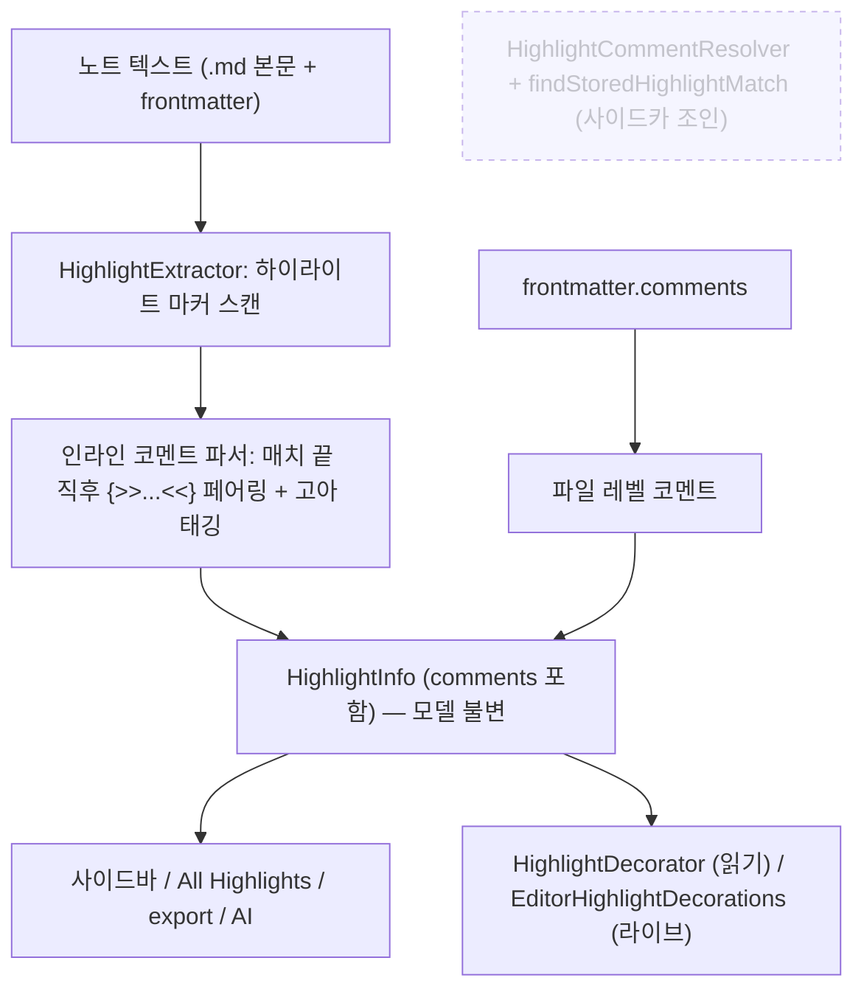
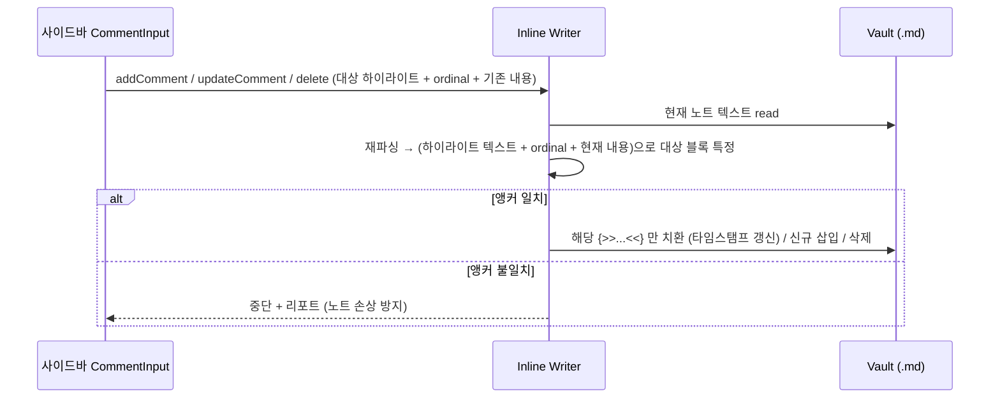
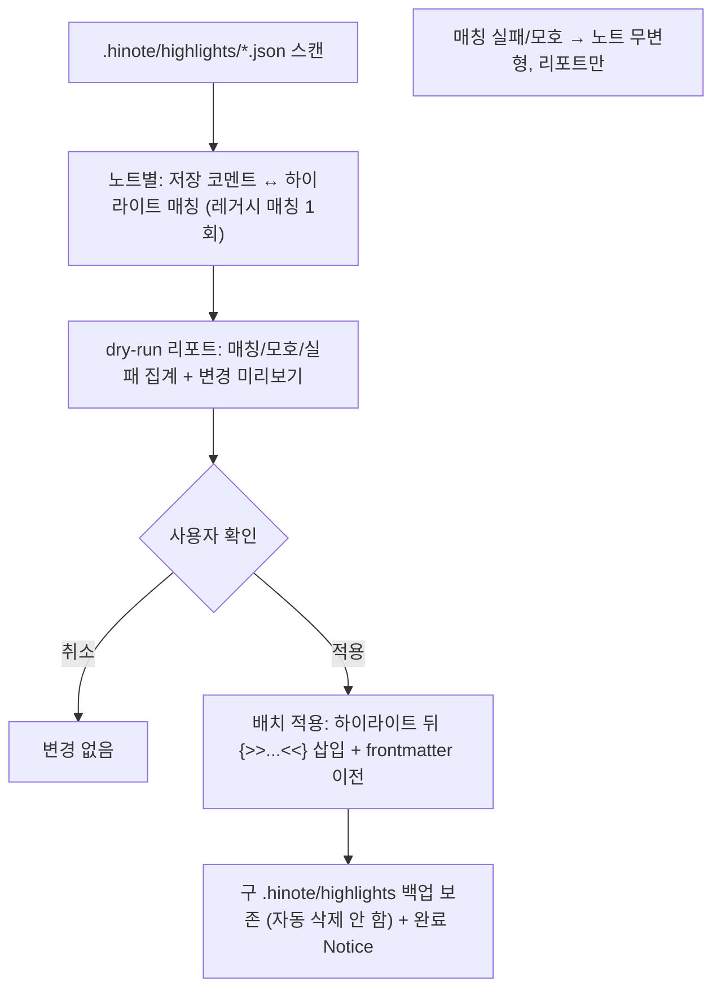

# feat: Migrate highlight comment storage to in-note inline format

## Summary

하이라이트 코멘트 데이터를 동기화되지 않는 사이드카 `.hinote/highlights/*.json`에서 **코멘트가 달린 노트 본문 안**으로 옮긴다. 하이라이트 직후 CriticMarkup `{>>텍스트 ^타임스탬프^<<}` 블록, 노트 전체 코멘트는 frontmatter `comments` 키에 저장한다. 인메모리 모델(`HighlightInfo`)과 사이드바·AI·export·렌더 파이프라인은 그대로 두고, "코멘트의 출처"만 사이드카 조인에서 인라인 파싱으로 바꾼다. 일회성 비파괴 마이그레이션과 vitest 테스트 계층을 함께 도입한다. Pro 플래시카드 저장은 범위 밖.

---

## Problem Frame

현재 HiNote는 하이라이트·코멘트를 Vault 루트 숨김 폴더 `.hinote/`에 노트별 JSON으로 저장하고 `app.vault.adapter`로 읽고 쓴다. `manifest.json`의 `isDesktopOnly: false`라 모바일을 지원하지만, **이 `.hinote/` 폴더는 Obsidian Sync로 동기화되지 않는다**. 사용자의 유일한 동기화 수단은 Obsidian Sync이므로 코멘트가 기기 간 전파되지 않는다.

브레인스토밍(`origin`)은 SQLite·`.obsidian` 내부 이동·가시 폴더·`data.json` 통합을 모두 기각하고, **Obsidian Sync에서 토글 없이 항상 동기화되는 유일한 파일 유형이 Markdown(`.md`)**이라는 사실에 근거해 인라인(in-note) 저장을 채택했다. 코멘트가 하이라이트에 물리적으로 인접하므로 "위치가 곧 연결"이 되어, 현재의 다중 전략 재매칭(`HighlightMatcher`)·파일 매핑·rename/orphan 처리 복잡성이 상당 부분 사라진다는 부수 이득도 있다.

이 계획은 그 WHAT을 HOW로 옮기며, plan 단계로 이월된 5개 Open Question(타임스탬프 파싱, 고아 코멘트, 커스텀 regex 부착, 마이그레이션 미리보기/롤백, 인덱싱)을 확정 결정으로 해소한다.

---

## Requirements

### 저장 포맷 (Storage format)

- R1. 하이라이트 코멘트는 하이라이트 마커 직후 CriticMarkup `{>>텍스트 ^타임스탬프^<<}` 블록으로 노트 본문에 저장된다 (see origin: §4.1).
- R2. 코멘트 텍스트는 평문이며 사용자가 소스에서 직접 읽고 편집할 수 있다. 메타데이터는 텍스트 뒤 `^...^` 단일 타임스탬프 토큰 하나로 분리된다 (see origin: §4.1).
- R3. 영속 ID를 인라인에 저장하지 않는다. 위치/출현 순서가 연결을 표현하며, 파싱 시 임시 ID를 생성한다 (see origin: §4.1).
- R4. AI 코멘트는 `{>>🤖 ...<<}` 접두로 사람 코멘트와 구분된다 (see origin: §4.1).
- R5. 노트 전체(파일 레벨) 코멘트는 frontmatter `comments` 키(`{text, ts}` 항목 리스트)로 저장·파싱된다 (see origin: §4.2).

### 동기화·렌더링 (Sync & rendering)

- R6. 코멘트가 `.md` 본문/frontmatter에 있으므로 Obsidian Sync가 토글 없이 네이티브로 동기화한다 (see origin: §8).
- R7. 읽기 뷰와 라이브 프리뷰에서는 `{>>...<<}` 원형을 숨기고 기존 HiNote의 작은 마커로 치환한다. 순수 소스 모드에서는 원형이 노출된다(불가피) (see origin: §4.3, §10-2).
- R8. 코멘트 존재 여부는 사이드카 조회가 아니라 인접 `{>>...<<}` 감지로 판단한다 (see origin: §4.3).
- R9. 사이드바·카드 UI·`CommentInput`·export·AI 코멘트 흐름은 인메모리 모델이 동일하므로 동작이 유지된다 (see origin: §6.2).

### 쓰기·인덱싱 (Write path & indexing)

- R10. 사이드바에서 코멘트를 추가/수정/삭제하면 노트 내 해당 `{>>...<<}` 블록이 정확히 갱신되고, 수정 시 타임스탬프 토큰이 최종 수정 시각으로 갱신된다 (see origin: §4.1).
- R11. 전체 조회는 로드 시 1회 인덱스 + `vault.on('modify')` 증분 갱신으로 유지된다 (see origin: §4.4).

### 마이그레이션·도구 (Migration & tooling)

- R12. 기존 `.hinote/highlights/*.json` 코멘트를 각 노트 본문에 인라인으로 옮기는 일회성 변환을 제공한다 (see origin: §7).
- R13. 마이그레이션은 비파괴적이다 — 노트를 수정하기 전 dry-run 미리보기를 제공하고, 매칭 실패/모호 항목은 노트를 변형하지 않고 리포트로 남기며, 구 `.hinote/highlights`는 자동 삭제하지 않는다 (see origin: §7).
- R14. 순수 로직(파서·시리얼라이저·frontmatter 변환·마이그레이션 변환)은 `obsidian` 런타임 의존 없이 단위 테스트할 수 있도록 분리되고, vitest로 검증된다 (see origin: §9).
- R15. "선택 텍스트/하이라이트에 코멘트 추가" 명령을 등록하고 기본 단축키 `Mod+Shift+C`를 제공한다(재바인딩 가능) (see origin: §5).

---

## Key Technical Decisions

- KTD1. **인라인 문법과 파싱 규칙.** 컨테이너는 CriticMarkup `{>> ... <<}`. 블록은 비탐욕(non-greedy)으로 매칭한다(가장 가까운 `<<}`까지). 타임스탬프는 블록 내용의 **끝에 앵커된** 엄격한 형식 토큰(`^YYYY-MM-DD HH:mm^`)으로만 인식하고, 그 앞 전체가 코멘트 텍스트다. 따라서 텍스트 중간의 `^`는 타임스탬프로 오인되지 않는다(OQ1 해소). 끝에 유효 토큰이 없으면 타임스탬프 부재로 보고 다음 저장 때 채운다. 쓰기 시 텍스트가 종료 시퀀스 `<<}`를 포함하면 새니타이즈한다(드문 엣지). AI 코멘트는 텍스트 선두 `🤖 ` 접두로 표현한다.
- KTD2. **ID 비영속.** 인라인에 ID를 두지 않는다. 파싱 시 임시 ID를 생성하고, 사이드바 편집은 위치/출현 순서로 대상을 특정한다(see origin: §4.1).
- KTD3. **쓰기 경로 안전성(최우선 리스크).** 사이드바 편집은 캐시된 위치 인덱스로 맹목적 재기록하지 않는다. 쓰기 시점에 노트를 **재파싱**하고 대상 블록을 `(하이라이트 텍스트 + 출현 순서 ordinal + 현재 코멘트 내용)`으로 특정한 뒤에만 치환한다. 앵커 불일치(파싱-쓰기 사이 노트가 바뀐 경우, 동시 편집·원격 Sync 반영 포함)면 **중단하고 사용자에게 리포트**한다 — 잘못된 블록을 덮어쓰는 노트 손상을 막는 가장 안전한 선택. 이 단위가 가장 무겁게 테스트된다.
- KTD4. **frontmatter `comments` 키 충돌 정책.** HiNote 전용 키로 네임스페이싱하지 않는다. HiNote는 `{text, ts}` **형태(shape)로 자기 항목을 식별**하고, 사용자/타 플러그인이 만든 이질적 형태의 `comments` 항목은 건드리지 않는다. 읽기는 `metadataCache.getFileCache().frontmatter`, 쓰기는 `app.fileManager.processFrontMatter()`로 안전하게 수행한다(OQ3-키 해소).
- KTD5. **고아 코멘트 정책.** 하이라이트 텍스트가 삭제되어 앞선 하이라이트 마커가 없는 `{>>...<<}`는 파싱 단계에서 **고아로 태깅**되고, 인메모리 모델에 보존되어 사이드바에 별도 그룹으로 노출된다. 플러그인은 고아를 **자동 삭제하지 않는다**(사용자 데이터). 정리는 사용자 명시 행위로만 한다(OQ2 해소).
- KTD6. **커스텀 regex 하이라이트 부착 규칙.** 코멘트 블록은 하이라이트 매치의 **전체 매치 끝(full-match end)** 직후에 붙는다. 파서는 `{>>...<<}`를 가장 가까운 선행 하이라이트 매치 끝에 페어링한다. 기본 마커(`==`, `<mark>`, `<span>`)와 사용자 정의 regex 규칙(`RegexRule`)에 동일하게 적용된다(OQ3-regex 해소).
- KTD7. **인덱싱 재사용.** 새 인프라를 짓지 않는다. 기존 `HighlightIndexer`(로드 시 빌드 + `HighlightIndexFileWatcher`의 `modify` 디바운스 증분)를 그대로 쓰되, 인덱스 소스를 사이드카 조인에서 **노트 텍스트 인라인 파싱**으로 바꾼다. 다중 전략 매칭과 파일 매핑 I/O가 사라지므로 노트당 비용은 현행보다 낮아진다. 성능 목표: 단일 노트 수정 시 재파싱 < ~50ms(전형적 노트), 대량 Vault 최초 빌드는 기존 청크/디바운스로 흡수(OQ5 해소).
- KTD8. **마이그레이션 순서와 비파괴성.** 마이그레이션은 매칭 로직을 마지막으로 1회 사용하므로 레거시 매처 제거(U11)보다 **엄격히 먼저** 실행되어야 한다. 마이그레이션에 필요한 매칭 코드는 마이그레이션 모듈로 옮기거나 복제해, 매처 삭제가 마이그레이션을 깨지 않게 한다. 구 `.hinote/highlights`는 자동 삭제하지 않고 백업+리포트만 남긴다. dry-run 미리보기 후 배치·확인 절차로 적용한다(OQ4 해소).
- KTD9. **테스트 아키텍처.** 순수 함수(파서/시리얼라이저/frontmatter/마이그레이션 변환)를 `app`·`vault` 의존 없이 추출하고, Obsidian API 의존부는 얇은 어댑터로 격리한다. 러너는 vitest, `obsidian` 모듈은 `resolve.alias`로 최소 스텁(`test/__mocks__/obsidian.ts`)에 매핑한다. 시리얼라이저는 스냅샷, 파서↔시리얼라이저는 round-trip(`parse(serialize(m)) === m`)으로 회귀를 막는다.
- KTD10. **기본 단축키.** `Mod+Shift+C`를 기본값으로 출시한다. Obsidian 가이드라인은 기본 단축키 지양을 권하나, 저충돌 조합이고 충돌 시 설정이 시각 표시하며 사용자가 재바인딩할 수 있다.

---

## High-Level Technical Design

### 읽기/파싱 데이터 흐름 — 사이드카 조인 제거



핵심 변경 한 곳: 현재 `EditorHighlightDecorations`와 사이드바 경로는 `extractHighlights()`로 뽑은 하이라이트를 `HighlightCommentResolver.getCommentsForHighlight()`로 리포지토리 캐시(사이드카)와 조인해 코멘트를 채운다. 인라인 전환 후에는 추출 단계에서 코멘트가 이미 채워져 나오므로 조인 단계가 사라진다.

### 쓰기 경로 — 재파싱 후 앵커 일치 시에만 치환 (KTD3)



### 마이그레이션 흐름 — dry-run → 확인 → 배치 적용 (비파괴)



---

## Output Structure

신규 모듈은 순수 로직 계층과 테스트에 집중된다. 기존 디렉터리에 추가/수정되는 파일은 단위별 `Files`가 정본이다.

```text
src/
  services/comment/
    inline/
      InlineCommentParser.ts        # 노트 텍스트 → 코멘트/고아 모델 (순수)
      InlineCommentSerializer.ts    # 코멘트 모델 + 노트 텍스트 → 패치 (순수)
      FrontmatterComments.ts        # frontmatter 객체 ↔ 파일 레벨 코멘트 (순수)
      InlineCommentWriter.ts        # 재파싱·앵커·processFrontMatter (Obsidian 어댑터)
  migration/
    InlineMigration.ts              # (.hinote JSON + 노트 텍스트) → 새 텍스트 + 리포트 (순수)
    InlineMigrationRunner.ts        # dry-run/배치/백업/Notice (Obsidian 어댑터)
  commands/
    addComment.ts                   # "코멘트 추가" 명령 + 기본 단축키
test/
  __mocks__/obsidian.ts             # 최소 스텁 (TFile/Vault 등)
  inline/*.test.ts                  # 파서/시리얼라이저/frontmatter/마이그레이션 단위·스냅샷·round-trip
vitest.config.ts
```

---

## Implementation Units

### Phase A — 테스트 인프라 + 순수 로직

### U1. vitest 테스트 인프라 도입

- **Goal:** `obsidian` 런타임 없이 순수 로직을 단위 테스트할 수 있는 vitest 환경을 구성한다.
- **Requirements:** R14
- **Dependencies:** 없음
- **Files:** `package.json`(devDep `vitest` 추가 + `test` 스크립트), `vitest.config.ts`(생성, `resolve.alias`로 `obsidian` → mock), `test/__mocks__/obsidian.ts`(생성, `TFile`/`Vault` 등 최소 스텁), 선택 `.github/workflows/test.yml`(생성, `npm test` + `tsc -noEmit`).
- **Approach:** `esbuild` 빌드와 독립적인 vitest 설정. TS/ESM 기본 지원. 기존 `tsconfig`와 충돌 없이 `vitest.config.ts`의 alias만으로 `obsidian` import를 스텁으로 돌린다. 의존성 추가이므로 승인 대상(boundaries: Ask First).
- **Patterns to follow:** 스펙 §9-2/§9-3의 vitest + obsidian alias 모킹.
- **Test scenarios:** `Test expectation: none -- 인프라/설정 단위(행위 변화 없음)`. 검증은 후속 단위의 테스트가 실제로 실행되는 것으로 간접 확인.
- **Verification:** `npm test`가 빈 스위트라도 정상 기동하고, `obsidian`을 import하는 더미 테스트가 alias 스텁으로 해석된다.

### U2. 인라인 코멘트 파서 (순수)

- **Goal:** 노트 텍스트에서 하이라이트별 인라인 코멘트와 고아 코멘트를 추출하는 순수 함수.
- **Requirements:** R1, R2, R3, R4, R8
- **Dependencies:** U1
- **Files:** `src/services/comment/inline/InlineCommentParser.ts`(생성), `test/inline/InlineCommentParser.test.ts`(생성).
- **Approach:** 입력은 노트 텍스트(+ 선택적으로 추출된 하이라이트 매치 목록). 출력은 하이라이트 매치 끝에 페어링된 코멘트 배열과 고아 목록. KTD1의 비탐욕 블록 매칭, 끝-앵커 타임스탬프(`^YYYY-MM-DD HH:mm^`), `🤖` 접두 AI 구분, KTD6의 전체 매치 끝 부착, KTD5의 고아 태깅을 구현한다. `obsidian` 의존 없음.
- **Execution note:** 도메인 신규 동작이므로 test-first로 작성한다.
- **Patterns to follow:** 마커 형식·이스케이프는 `src/utils/HighlightRegexUtils.ts`(`escapeRegExp`, `==`/`<mark>`/`<span>`/customRegex 처리)를 참조해 일관성 유지.
- **Test scenarios:**
  - 단일 하이라이트 + 단일 코멘트(타임스탬프 있음) → 텍스트/타임스탬프 정확 분리.
  - 하이라이트 + 다중 연속 `{>>...<<}` 블록 → 순서 보존된 코멘트 배열.
  - `{>>🤖 ...<<}` → AI 코멘트로 플래그.
  - 타임스탬프 없는 블록 → 텍스트만, 타임스탬프 부재 표시.
  - 텍스트 중간에 `^` 포함(끝 토큰 아님) → 타임스탬프로 오인하지 않음(KTD1).
  - 선행 하이라이트 없는 `{>>...<<}` → 고아로 태깅(KTD5).
  - `<mark>`/`<span>`/커스텀 regex 매치 끝 직후 블록 → 올바른 하이라이트에 페어링(KTD6).
  - 빈 노트 / 코멘트 없는 하이라이트 → 빈 결과, 예외 없음.
- **Verification:** 위 시나리오 전부 통과, `obsidian` import 없이 Node에서 실행.

### U3. 인라인 코멘트 시리얼라이저 (순수)

- **Goal:** 코멘트 모델 변경을 노트 텍스트 패치로 반영하는 순수 함수(삽입/수정/삭제, 타임스탬프 갱신, 종료 시퀀스 새니타이즈).
- **Requirements:** R1, R2, R4, R10
- **Dependencies:** U2
- **Files:** `src/services/comment/inline/InlineCommentSerializer.ts`(생성), `test/inline/InlineCommentSerializer.test.ts`(생성).
- **Approach:** 입력은 원본 노트 텍스트 + 대상 하이라이트(텍스트/ordinal) + 연산. 출력은 패치된 텍스트. 주변 텍스트를 보존하고 대상 블록만 변경한다. 텍스트에 `<<}` 포함 시 새니타이즈(KTD1). 앵커 매칭 자체는 U2 파서를 재사용한다.
- **Execution note:** test-first. 시리얼라이저는 스냅샷 + round-trip으로 회귀 방지.
- **Test scenarios:**
  - 신규 코멘트 삽입 → 하이라이트 끝 직후 `{>>텍스트 ^ts^<<}` 추가, 주변 텍스트 불변.
  - 기존 코멘트 텍스트 수정 → 해당 블록만 변경 + 타임스탬프 최종 수정 시각으로 갱신(R10).
  - 코멘트 삭제 → 해당 블록만 제거, 인접 공백 정리.
  - AI 코멘트 직렬화 → `🤖` 접두 유지.
  - 텍스트에 `<<}` 포함 → 새니타이즈되어 블록 구조 깨지지 않음.
  - round-trip: 임의 코멘트 모델 → serialize → parse → 동일 모델.
  - 스냅샷: 대표 입력 노트 → 출력 텍스트 스냅샷 일치.
- **Verification:** round-trip·스냅샷 통과, 주변 텍스트 보존 확인.

### U4. frontmatter 코멘트 변환 (순수)

- **Goal:** frontmatter 객체와 파일 레벨 코멘트 리스트 간 양방향 변환 + 충돌 안전 식별.
- **Requirements:** R5
- **Dependencies:** U1
- **Files:** `src/services/comment/inline/FrontmatterComments.ts`(생성), `test/inline/FrontmatterComments.test.ts`(생성).
- **Approach:** 읽기는 `comments` 배열 중 `{text, ts}` 형태 항목만 HiNote 항목으로 인식(KTD4). 쓰기는 HiNote 항목만 갱신하고 이질적 항목은 보존하는 병합 함수. `processFrontMatter` 호출은 U7 어댑터에서, 이 모듈은 순수 객체 변환만 담당.
- **Execution note:** test-first.
- **Test scenarios:**
  - `comments`가 `{text, ts}` 리스트 → 파일 레벨 코멘트로 정확 파싱.
  - 기존 `comments`에 문자열/이질 객체 혼재 → HiNote 항목만 인식, 나머지 보존.
  - `comments` 키 부재 → 빈 리스트, 예외 없음.
  - 파일 레벨 코멘트 추가/수정/삭제 → 이질 항목 불변 유지하며 병합.
- **Verification:** 충돌 보존 시나리오 포함 전부 통과.

### U5. 마이그레이션 변환 (순수)

- **Goal:** `.hinote` 코멘트 JSON + 노트 텍스트를 입력받아 인라인이 삽입된 새 노트 텍스트와 매칭 리포트를 산출하는 순수 함수.
- **Requirements:** R12, R13
- **Dependencies:** U3, U4
- **Files:** `src/migration/InlineMigration.ts`(생성), `test/migration/InlineMigration.test.ts`(생성). 매칭 로직은 KTD8에 따라 `src/services/highlight/HighlightMatchStrategies.ts`에서 마이그레이션 모듈로 이전/복제.
- **Approach:** 저장 코멘트를 하이라이트 위치에 매칭(레거시 매칭 1회), 하이라이트 뒤 `{>>...<<}` 삽입, 파일 레벨은 frontmatter로 이전. 매칭 실패/모호 항목은 텍스트를 바꾸지 않고 리포트 엔트리로 분류. 시리얼라이저(U3)·frontmatter 변환(U4)을 재사용.
- **Execution note:** 가장 위험한 변환이므로 test-first + 실패/모호 경로를 명시적으로 커버.
- **Test scenarios:**
  - 단일 하이라이트 + 1 코멘트 사이드카 → 인라인 1개 삽입된 텍스트.
  - 다중 코멘트 → 순서 보존 삽입.
  - 파일 레벨 코멘트 → frontmatter `comments`로 이전.
  - 매칭 모호(동일 텍스트 다수) → 텍스트 무변형 + 리포트에 모호로 기록.
  - 매칭 실패(하이라이트 사라짐) → 텍스트 무변형 + 리포트에 실패로 기록.
  - 이미 인라인이 존재하는 노트 → 멱등(중복 삽입 없음).
- **Verification:** 비파괴(실패/모호 시 입력 텍스트 그대로) + 멱등 확인.

### Phase B — Obsidian 통합

### U6. 추출 파이프라인에 인라인 파싱 통합 (사이드카 조인 은퇴)

- **Goal:** 하이라이트 추출 시 인접 `{>>...<<}`를 직접 파싱해 코멘트가 채워진 모델을 만들고, `HighlightCommentResolver` 조인을 제거한다.
- **Requirements:** R8, R9, R11
- **Dependencies:** U2, U4
- **Files:** `src/services/highlight/HighlightExtractor.ts`(수정), `src/services/HighlightService.ts`(수정), `src/services/highlight/HighlightIndexer.ts`·`HighlightIndexFileWatcher.ts`(인덱스 소스 확인/조정), `src/repositories/HighlightRepository.ts`(코멘트 소스 변경 반영). frontmatter 파일 레벨 코멘트는 `metadataCache` 경유로 모델에 합류.
- **Approach:** `extractHighlights()`가 U2 파서를 호출해 코멘트·고아를 포함한 `HighlightInfo`를 반환하도록 한다. 인메모리 모델 형태(`HighlightInfo`)는 불변이라 사이드바·export·AI 등 45개 소비자는 변경 불필요. 인덱서는 KTD7대로 기존 로드+`modify` 디바운스를 유지하되 소스만 인라인 파싱으로 바꾼다. 고아는 모델에 보존되어 사이드바 그룹으로 노출(KTD5).
- **Patterns to follow:** 현재 `EditorHighlightDecorations.buildDecorations`의 `extractHighlights → getCommentsForHighlight` 흐름을 단일 추출로 대체.
- **Test scenarios:**
  - 인라인 코멘트가 있는 노트 텍스트 → 추출 결과 `HighlightInfo.comments`가 채워짐(어댑터로 파서 호출 경로 검증).
  - frontmatter 코멘트 → 파일 레벨 코멘트로 모델 합류.
  - 고아 `{>>...<<}` → 모델에 고아로 표면화, 자동 삭제 없음.
  - 코멘트 없는 하이라이트 → 빈 comments, 마커 비표시 신호.
  - 통합: `modify` 이벤트 후 증분 재인덱스가 갱신된 코멘트를 반영.
- **Verification:** 사이드바/All Highlights가 인라인 코멘트를 표시, 사이드카 조회 경로가 더 이상 호출되지 않음.

### U7. 코멘트 쓰기 경로 — 인라인 + frontmatter (재파싱·앵커)

- **Goal:** 코멘트 추가/수정/삭제가 사이드카가 아니라 노트 본문(`{>>...<<}`)과 frontmatter에 안전하게 기록되게 한다.
- **Requirements:** R10, R5
- **Dependencies:** U3, U4, U6
- **Files:** `src/services/comment/CommentService.ts`(수정: `addComment`/`updateComment`/삭제 경로), `src/services/comment/inline/InlineCommentWriter.ts`(생성: 재파싱·앵커·`processFrontMatter` 어댑터), `src/views/highlight/comments/CommentController.ts`(쓰기 호출부 확인), `test/inline/InlineCommentWriter.test.ts`(앵커 로직 단위).
- **Approach:** KTD3 — 쓰기 시점에 노트를 read·재파싱하고 `(하이라이트 텍스트 + ordinal + 현재 내용)`으로 대상 블록을 특정한 뒤에만 U3 시리얼라이저로 패치한다. 불일치 시 중단+리포트. 파일 레벨 코멘트는 `app.fileManager.processFrontMatter()`로 U4 병합 적용. Vault 쓰기는 `app.vault.modify`/`process` 사용.
- **Execution note:** 가장 위험한 단위 — 앵커 일치/불일치 경로를 test-first로 두껍게 커버.
- **Test scenarios:**
  - 추가: 대상 하이라이트 뒤 신규 블록 삽입, 다른 코멘트 불변.
  - 수정: ordinal로 정확한 블록만 갱신 + 타임스탬프 갱신.
  - 삭제: 해당 블록만 제거.
  - 앵커 불일치(쓰기 직전 노트 텍스트가 달라짐) → 쓰기 중단 + 리포트, 노트 미변형(손상 방지, 핵심).
  - 동일 텍스트 하이라이트 2개 → ordinal로 올바른 쪽 선택.
  - 파일 레벨 코멘트 추가/수정 → frontmatter 병합, 이질 항목 보존.
- **Verification:** 정상 편집이 노트에 반영되고, 불일치 시 손상 없이 사용자에게 알림.

### U8. 렌더링 — 인접 감지 + 원형 숨김 (기존 마커 재사용)

- **Goal:** 코멘트 존재 판단을 인접 `{>>...<<}` 감지로 바꾸고, 읽기 뷰·라이브 프리뷰에서 원형을 숨겨 기존 마커로 치환한다.
- **Requirements:** R7, R8
- **Dependencies:** U2, U6
- **Files:** `src/editor/HighlightDecorator.ts`(수정: `registerMarkdownPostProcessor`로 `{>>...<<}` 숨김+마커), `src/editor/EditorHighlightDecorations.ts`(수정: `createCommentWidget` 트리거를 인접 감지 기반으로, 조인 제거), `styles.css`(필요 시 숨김 규칙).
- **Approach:** `EditorHighlightDecorations`는 이미 `createCommentWidget`/`CommentWidget`을 가지므로 위젯 자체는 재사용. 변경점은 "코멘트 존재" 판단을 U6의 모델 코멘트 유무로 삼고, 라이브 프리뷰/읽기에서 `{>>...<<}` 원문 범위를 숨기는 데코레이션을 추가. 순수 소스 모드는 원형 노출(R7, 불가피).
- **Test scenarios:**
  - `Test expectation: 통합/수동 위주` — 렌더는 CodeMirror/postprocessor 런타임 의존이 커 자동 단위 테스트 가치가 낮음. 숨김 범위 계산 등 추출 가능한 순수 보조 함수만 단위 테스트.
  - 수동(테스트 Vault): 읽기 뷰에서 `{>>...<<}` 숨김 + 마커 표시.
  - 수동: 라이브 프리뷰에서 동일.
  - 수동: 순수 소스 모드에서 원형 노출.
  - 수동: 플러그인 비활성 시 원형 노출(데이터는 읽힘).
- **Verification:** 테스트 Vault 수동 체크리스트(§9-5) 통과.

### U9. "코멘트 추가" 명령 + 기본 단축키

- **Goal:** 선택 텍스트/하이라이트에 코멘트를 추가하는 명령과 기본 단축키 `Mod+Shift+C`를 등록한다.
- **Requirements:** R15
- **Dependencies:** U7
- **Files:** `src/commands/addComment.ts`(생성), `src/commands/index.ts`(수정: 등록 추가).
- **Approach:** `editorCallback`으로 등록, `Mod+Shift+C` 기본 hotkey. Command Palette·에디터 메뉴에서도 접근. 안정적 command ID 사용(릴리스 후 변경 금지). 명령은 U7 쓰기 경로를 호출.
- **Patterns to follow:** 기존 `src/commands/openCommentPanel.ts`/`openMainWindow.ts`의 등록 구조.
- **Test scenarios:**
  - `Test expectation: 수동 위주` — 명령 등록/단축키는 런타임 의존.
  - 수동: 텍스트 선택 → `Mod+Shift+C` → 인라인 `{>>...<<}` 생성.
  - 수동: 기존 하이라이트에서 호출 → 해당 하이라이트에 코멘트 부착.
  - 수동: 단축키 충돌 시 설정에서 재바인딩 가능.
- **Verification:** 명령이 팔레트에 나타나고 단축키로 코멘트가 생성됨.

### Phase C — 마이그레이션·정리·문서

### U10. 마이그레이션 러너 — dry-run·배치·백업

- **Goal:** U5 변환을 실제 Vault에 적용하는 사용자 흐름(미리보기→확인→배치→백업)을 제공한다.
- **Requirements:** R12, R13
- **Dependencies:** U5, U7
- **Files:** `src/migration/InlineMigrationRunner.ts`(생성), 진입점(설정 탭 버튼 또는 명령) — `src/settings/tabs/GeneralSettingsTab.ts` 또는 `src/commands/`에 추가.
- **Approach:** `.hinote/highlights/*.json` 스캔 → U5로 노트별 변환 산출 → dry-run 리포트(매칭/모호/실패 + 미리보기) → 사용자 확인 → 배치 적용(Sync 부하/diff 폭증 완화) → 구 데이터 백업 보존(자동 삭제 금지) + 완료 Notice. 실패/모호는 리포트만.
- **Execution note:** 핵심·위험. 적용 전 사용자 확인 게이트 필수.
- **Test scenarios:**
  - U5 변환 결과를 러너가 dry-run으로 집계(러너의 순수 집계 부분 단위 테스트).
  - 확인 취소 → Vault 무변경.
  - 적용 → 노트에 인라인 반영, `.hinote/highlights` 백업 잔존.
  - 수동(테스트 Vault): dry-run 미리보기 → 적용 → 사이드바 일치 → 재시작 후 재파싱.
- **Verification:** dry-run이 변경 없이 리포트를 내고, 적용 후 구 데이터가 보존됨.

### U11. 사이드카 하이라이트 저장·매처 은퇴 (마이그레이션 이후)

- **Goal:** 인라인 전환으로 불필요해진 사이드카 하이라이트 I/O와 다중 전략 매칭 코드를 제거한다(플래시카드 저장은 유지).
- **Requirements:** R6, R9 (단순화로 회귀 없이 동작 유지)
- **Dependencies:** U6, U7, U10 (KTD8: 마이그레이션보다 반드시 나중)
- **Files:** `src/storage/HiNoteDataManager.ts`(하이라이트 JSON I/O·rename/orphan 제거; 플래시카드 경로 유지), `src/storage/FileMappingStore.ts`·`src/storage/FilePathUtils.ts`(highlights 경로/safe-name 제거), `src/services/highlight/HighlightMatcher.ts`·`HighlightMatchStrategies.ts`·`HighlightCommentResolver.ts`(축소/제거), 이들 소비자(`src/services/InitializationManager.ts`, `src/repositories/HighlightRepository.ts` 등) 정리.
- **Approach:** 변경으로 고아가 된 import/심볼만 제거(surgical). `.hinote/` 디렉터리와 `FlashcardDataStore`는 플래시카드 용도로 잔존. 제거 전 `codegraph_impact`로 blast radius 확인.
- **Execution note:** 삭제 단위 — 기존 테스트/타입 체크가 통과하는지로 회귀 확인. 매처 삭제가 U10 마이그레이션을 깨지 않도록 순서 엄수(KTD8).
- **Test scenarios:**
  - `Test expectation: none -- 제거/정리(행위 변화 없음)`. 회귀는 U2~U7 스위트 + `tsc -noEmit`로 확인.
- **Verification:** `npm run build`(`tsc -noEmit` 포함) 통과, 사이드바·export·AI 동작 회귀 없음, 플래시카드 정상.

### U12. 문서 — 동기화 동작·한계·단축키·고아 처리

- **Goal:** 사용자/기여자에게 새 저장 모델의 동작과 한계를 명시한다.
- **Requirements:** R6, R7 (한계 명시), R15
- **Dependencies:** U8, U9, U10
- **Files:** `README.md`(수정), 필요 시 설정 탭 도움말 문자열.
- **Approach:** Obsidian Sync 네이티브 동기화, 동시 오프라인 편집 충돌(일반 마크다운과 동일), 순수 소스 모드 원형 노출, 비활성 시 원형 노출, CriticMarkup 플러그인 동시 사용 시 이중 스타일, 기본 단축키, 고아 코멘트 처리 정책을 문서화.
- **Test scenarios:** `Test expectation: none -- 문서`.
- **Verification:** README가 동기화 동작·한계·단축키·고아 정책을 정확히 반영.

---

## Scope Boundaries

### 범위 내

- 하이라이트 코멘트의 저장 위치·포맷 재설계(인라인 + frontmatter), 파싱/쓰기/렌더 시임 전환, 일회성 마이그레이션, vitest 테스트 계층, 코멘트 추가 명령/단축키.

### Outside this product's identity (범위 밖)

- **Pro 플래시카드 저장**(`.hinote/flashcards/`, `FlashcardDataStore`)은 손대지 않는다. `.hinote/` 디렉터리는 플래시카드 용도로 잔존(see origin: §6.2).
- 사이드바/카드 UI 재설계, 마커 비주얼 변경 — 기존 것을 재사용(see origin: §4.3).
- 동시 편집 자동 병합 — 일반 마크다운 노트와 동일한 Obsidian Sync 충돌 흐름을 따른다(see origin: §8).

### Deferred to Follow-Up Work

- 고아 코멘트 전용 정리 UI(일괄 재부착/삭제 마법사) — 핵심 정책(태깅·비자동삭제·사이드바 표면화)은 범위 내, 고급 정리 도구는 후속.
- CI 워크플로(`.github/workflows/test.yml`)는 U1에서 선택 사항 — 미도입 시 후속.

---

## Risks & Dependencies

- **플러그인이 사용자 노트를 수정한다(최대 전환).** 쓰기 경로 안전성(KTD3)과 두꺼운 테스트가 핵심 완화책. 앵커 불일치 시 중단+리포트로 손상 방지.
- **대량 마이그레이션이 다수 노트를 변경 → Sync 부하·diff 폭증.** dry-run·배치·확인으로 완화(U10).
- **마이그레이션↔매처 제거 순서 의존(KTD8).** U11이 U10 이후임을 의존성으로 고정. 매칭 코드는 마이그레이션 모듈로 이전.
- **순수 소스 모드/비활성 시 원형 `{>>...<<}` 노출**(불가피) — 문서화(U12).
- **CriticMarkup 플러그인 동시 사용 시 이중 스타일** — 문서화(U12).
- **의존성 추가(vitest)** — boundaries상 Ask First. U1에서 명시 승인.
- **frontmatter `comments` 키 충돌** — KTD4 형태 기반 식별로 완화.

---

## Open Questions (실행 시 해소)

- 종료 시퀀스 새니타이즈의 정확한 치환 표현(zero-width 삽입 vs 엔티티) — 구현 시 round-trip 안전성으로 결정(KTD1 범위 내).
- 대량 Vault 최초 인덱싱의 구체 청크 크기/디바운스 값 — 실제 노트 텍스트 파싱 성능 측정 후 튜닝(KTD7 목표치 기준).
- 마이그레이션 백업의 물리적 위치/형식(원본 `.hinote/highlights` 보존 vs 별도 `.bak`) — U10 구현 시 확정.

---

## System-Wide Impact

- **데이터 수명주기:** 코멘트의 정본이 사이드카에서 노트 본문/frontmatter로 이동. 플러그인 삭제 후에도 코멘트가 노트에 잔존(이식성↑).
- **동기화 경계:** 코멘트가 `.md`에 포함되어 Obsidian Sync 네이티브 동기화 대상이 됨.
- **인메모리 계약 불변:** `HighlightInfo`/`CommentItem` 형태를 유지해 사이드바·export·AI·플래시카드 이벤트 등 다수 소비자(HighlightService 45 callers 등)를 보호. 변경은 "코멘트 소스"와 "쓰기 대상"에 국한.
- **모바일:** `isDesktopOnly: false` 유지. 인라인 파싱/`processFrontMatter`/CodeMirror 데코레이션은 모바일 호환 경로를 사용.

---

## Acceptance Examples

- AE1. **인라인 생성** — Given 소스 모드에서 `==세포의 발전소==` 선택, When `Mod+Shift+C`로 "중요한 포인트" 입력·저장, Then 본문이 `==세포의 발전소=={>>중요한 포인트 ^YYYY-MM-DD HH:mm^<<}`가 되고 사이드바에 코멘트가 표시된다.
- AE2. **읽기 뷰 숨김** — Given 위 노트, When 읽기 뷰로 전환, Then `{>>...<<}` 원형은 숨고 하이라이트 + 작은 마커만 보인다.
- AE3. **타임스탬프 오인 방지** — Given 코멘트 텍스트가 `x^2 형태`처럼 `^`를 포함, When 파싱, Then 끝-앵커 토큰만 타임스탬프로 인식되어 텍스트가 보존된다.
- AE4. **쓰기 앵커 불일치** — Given 사이드바 편집 직전 노트 텍스트가 외부에서 변경됨, When 저장 시 재파싱, Then 앵커 불일치로 쓰기를 중단하고 사용자에게 리포트하며 노트는 변형되지 않는다.
- AE5. **마이그레이션 비파괴** — Given 모호하게 매칭되는 코멘트, When 마이그레이션 적용, Then 해당 노트 텍스트는 바뀌지 않고 리포트에 모호로 기록되며 구 `.hinote/highlights`는 보존된다.

---

## Sources / Research

- Origin 설계 문서: `docs/superpowers/specs/2026-06-18-inline-comment-storage-design.md`.
- 코멘트 조회 시임: `src/services/highlight/HighlightCommentResolver.ts`, `src/editor/EditorHighlightDecorations.ts`(`buildDecorations`의 `extractHighlights → getCommentsForHighlight → createCommentWidget`).
- 사이드카 저장: `src/storage/HiNoteDataManager.ts`(`getFileHighlights`/`saveFileHighlights`), `src/storage/FileMappingStore.ts`, `src/storage/FilePathUtils.ts`.
- 매칭: `src/services/highlight/HighlightMatcher.ts`, `HighlightMatchStrategies.ts`.
- 추출·정규식: `src/services/highlight/HighlightExtractor.ts`, `src/utils/HighlightRegexUtils.ts`.
- 인덱싱(재사용): `src/services/highlight/HighlightIndexer.ts`, `HighlightIndexFileWatcher.ts`, `HighlightIndexStore.ts`.
- 모델: `src/types/highlight.ts`(`HighlightInfo`, `CommentItem`).
- 명령: `src/commands/index.ts`, `openCommentPanel.ts`, `openMainWindow.ts`.
- 쓰기 경로: `src/services/comment/CommentService.ts`(`addComment`/`updateComment`).
- manifest: `manifest.json`(id `hi-note`, v0.5.7, minAppVersion 1.8.0, `isDesktopOnly: false`).
- 테스트 전략: 스펙 §9(순수 로직 분리 + vitest + obsidian alias 모킹 + 스냅샷 + 테스트 Vault 수동 체크리스트).

---

## Verification (end-to-end)

1. `npm test` — U2~U7의 순수 로직 단위·스냅샷·round-trip 통과.
2. `npm run build`(`tsc -noEmit -skipLibCheck` 포함) — 타입/빌드 클린, U11 제거 후 고아 import 없음.
3. 테스트 Vault(스펙 §9-5): 빌드 산출물을 `<vault>/.obsidian/plugins/hi-note/`에 링크 → 텍스트 선택 → `Mod+Shift+C` → 인라인 생성 → 읽기 뷰 숨김/마커 → 사이드바 표시 → 재시작 후 재파싱 → (가능 시) 두 기기 Sync 동기화 → 마이그레이션 dry-run → 적용 후 구 데이터 보존 확인.
4. 회귀: 사이드바/export/AI 코멘트 흐름과 Pro 플래시카드가 정상 동작.
