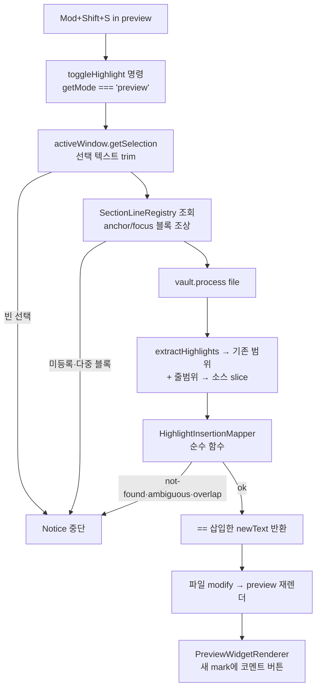

# feat: 읽기 모드 하이라이트 (Mod+Shift+S 통합 명령) — 구현 플랜

- 작성일: 2026-06-21
- 유형: feat / Standard
- Origin 스펙: `docs/superpowers/specs/2026-06-21-reading-mode-highlight-design.md`
- 빌드 세션 저장 경로(승인 후): `docs/plans/2026-06-21-001-feat-reading-mode-highlight-plan.md`

---

## Branch & Git

현재 브랜치는 기본 브랜치 `master`다. **`master`에서 직접 작업하지 않는다.** 빌드 세션은 새 피처 브랜치에서 시작한다(git-workflow 규칙 `<type>/<short-description>`):

- 브랜치: `feat/reading-mode-highlight` (`master`에서 분기).
- 커밋은 사용자 요청 시에만(메시지는 한국어 conventional 형식). 단위별 커밋은 U1~U5 경계를 따른다.
- 빌드 세션 첫 단계: `git switch -c feat/reading-mode-highlight` 후 구현 착수.

---

## Context

하이라이트의 본질은 마크다운 `==text==`다(플러그인이 `extractHighlights`로 추출해 코멘트·AI·플래시카드를 얹는다). 편집 모드에서는 사용자가 텍스트를 선택하고 **Obsidian 네이티브 "Toggle highlight"**(Mod+Shift+S에 바인딩)로 `==...==`를 삽입한다. 그러나 읽기 모드는 읽기 전용 렌더 HTML이라 에디터가 없고 네이티브 명령이 비활성이라, 같은 단축키로 하이라이트할 수 없다.

목표: **읽기 모드에서도 같은 Mod+Shift+S로** 선택 텍스트를 하이라이트한다. 삽입 직후 기존 읽기 모드 후처리기(`PreviewWidgetRenderer.processPreview`)가 새 `<mark>`를 감지해 코멘트 버튼·툴팁을 자동으로 붙이므로, 기존 hinote enhanced 흐름이 그대로 이어진다.

유일한 난관은 **렌더된 DOM 선택 → 마크다운 소스 위치 매핑**이다. 읽기 모드 `textContent`는 inline 마크다운 마커가 제거된 상태라(`docs/solutions/ui-bugs/reading-mode-markdown-highlight-comment-mismatch.md`에 문서화), 소스에 verbatim 매칭되지 않는 선택이 존재한다. MVP는 verbatim·유일 매칭만 처리하고 나머지는 안전하게 중단한다.

---

## Problem Frame

- **In scope**: 읽기 모드(`preview`)에서 선택 텍스트를 `==...==`로 감싸 소스에 삽입하는 단일 통합 명령. 편집 모드(`source`)는 네이티브 동작 위임으로 보존. 데스크톱 단축키 트리거.
- **핵심 제약**: 명령 핸들러에는 `MarkdownPostProcessorContext`가 없어 `getSectionInfo`를 직접 쓸 수 없다 → 보조 패스로 블록 줄범위를 미리 기록해야 한다.
- **안전 우선**: 사용자 노트를 직접 수정하므로, 모호·실패 케이스는 모두 무수정 중단 + `Notice`.

---

## Requirements

- R1. 읽기 모드에서 `Mod+Shift+S`로 선택한 plain 텍스트가 소스에서 `==...==`로 감싸진다.
- R2. 편집 모드에서 같은 명령은 기존 네이티브 Toggle highlight 동작(토글오프 포함)을 그대로 유지한다.
- R3. 삽입 후 추가 작업 없이 읽기 모드에 하이라이트 + 코멘트 버튼이 나타난다(기존 흐름 재사용).
- R4. 다음은 모두 무수정 중단 + 사유 `Notice`: 빈 선택, 다중 블록 선택, verbatim 매칭 실패(inline 마크다운), 다중 매칭(모호), 기존 하이라이트와 겹침(double-wrap 방지), 블록 줄범위 조회 실패.
- R5. 매핑 핵심 로직은 DOM·vault 비의존 순수 함수로 분리해 단위 테스트한다.

---

## Key Technical Decisions

- **KTD1 — 통합 명령이 Mod+Shift+S 소유, 편집 모드는 네이티브에 위임.** 단일 명령 `hi-note:toggle-highlight`가 `getMode()`로 분기: `source`→네이티브 `editor:toggle-highlight` 위임, `preview`→읽기 모드 로직. 사용자는 네이티브의 Mod+Shift+S 바인딩을 1회 해제. *근거*: 한 단축키로 양 모드 일관, hotkey 공존의 취약성 회피.
  - **의식적 선택 — 기본 hotkey 선언함**: 명령에 기본 `Mod+Shift+S`를 선언한다(선례 `toggleInlineCommentSyntax`의 Mod+Shift+C와 동일 패턴, 발견성↑, 사용자 의도와 직결). *트레이드오프*: 사용자가 네이티브 바인딩을 해제하기 전까지 Obsidian이 **충돌 경고**를 표시한다(README 1회 단계로 해소; R4). 대안(기본 미선언 + 사용자가 직접 지정)도 가능하나 읽기 모드에서 키를 눌러도 무반응인 혼란이 더 크다고 판단.
- **KTD2 — WeakMap 섹션 줄범위 레지스트리.** 기존 preview 후처리 경로에 보조 후처리기를 추가해 각 렌더 블록 `el`의 `context.getSectionInfo(el).{lineStart,lineEnd}`를 `WeakMap<Element, …>`에 기록. 명령은 선택의 블록 조상으로 조회. *근거*: 지원 API(`getSectionInfo`)에 머묾, 내부 API 회피, GC 자동 정리.
- **KTD3 — MVP는 verbatim·유일·단일 블록만.** 선택 plain 텍스트가 블록 소스 범위에서 유일 substring일 때만 래핑. 그 외 graceful 중단. *근거*: 렌더 `textContent` ≠ raw 소스(문서화된 한계). inline 마크다운 섞인 선택의 역매핑은 범위 밖.
- **KTD4 — `vault.process`로 디스크 원자적 쓰기.** *근거*: 읽기 모드는 저장된 디스크 내용을 렌더하므로, 에디터 컨텍스트의 좌표 desync(`docs/solutions/logic-errors/comment-insert-position-coordinate-desync.md`)에서 자유롭다. `vault.process(file, fn)`는 fresh read + atomic write를 보장. 선례: `src/views/highlight/actions/HighlightDeletionManager.ts:97`, `src/services/highlight/HighlightBatchOps.ts:58`.

---

## High-Level Technical Design

읽기 모드 명령 실행 데이터 흐름:

보조 패스(상시): 모든 렌더 블록 → `recordSectionLines(el, ctx)` → `WeakMap.set(el, {lineStart,lineEnd})`.

---

## Implementation Units

### U1. 섹션 줄범위 레지스트리 + 기록 후처리기

- **Goal**: 읽기 모드 각 블록의 소스 줄범위를 명령이 조회할 수 있게 기록한다.
- **Requirements**: R1, R4
- **Dependencies**: 없음
- **Files**:
  - `src/editor/SectionLineRegistry.ts` (신규) — `WeakMap<Element, {lineStart:number; lineEnd:number}>` 래퍼 + `findBlockRange(node: Node)` 조상 탐색 조회.
  - `src/editor/HighlightDecorator.ts` (수정) — 레지스트리 인스턴스 보유, `enable()`에 기록 후처리기 등록, getter 노출.
  - `test/editor/SectionLineRegistry.test.ts` (신규, `// @vitest-environment happy-dom`).
- **Approach**: `enable()`에 `registerMarkdownPostProcessor((el, ctx) => { const info = ctx.getSectionInfo(el); if (info) registry.set(el, {lineStart: info.lineStart, lineEnd: info.lineEnd}); })` 추가. 이 후처리기는 `processPreview`의 `marks.length===0` 조기 반환과 **무관하게** 모든 블록에서 동작해야 하므로 별도 등록. `findBlockRange`는 `node`에서 `parentElement` 체인을 따라 올라가며 레지스트리에 등록된 첫 엘리먼트의 범위를 반환, 없으면 `null`.
- **Patterns to follow**: `HighlightDecorator.enable()`의 기존 `registerMarkdownPostProcessor`; `PreviewHighlightResolver.getSectionInfo`의 `context.getSectionInfo(block)` 사용.
- **Execution note (load-bearing 가정 조기 검증)**: 이 설계 전체가 "기록 후처리기의 `el`에서 `getSectionInfo`가 유효 범위를 주고, 그 `el`이 라이브 선택 anchor의 조상 체인에 실제로 존재한다"에 달려 있다(R3). **U3/U4 착수 전에** 실제 vault에서 1회 수동 확인: (a) 기록 후처리기가 올바른 줄범위를 캡처하는가, (b) `findBlockRange(selection.anchorNode)`가 그 블록을 복구하는가. 한 가정을 먼저 떨어뜨려 보면 후속 단위가 헛수고가 되지 않는다.
- **Test scenarios**:
  - set 후 같은 엘리먼트로 get → 동일 범위 반환.
  - 자식 텍스트 노드에서 `findBlockRange` → 등록된 블록 조상 범위 반환.
  - 미등록 노드 → `null`.
- **Verification**: 읽기 모드에서 임의 블록의 줄범위가 조회된다(위 execution note의 수동 확인 포함).

### U2. 삽입 매핑 순수 함수 (핵심)

- **Goal**: `(sourceText, lineStart, lineEnd, selectedText, existingHighlights)` → 삽입 결과 또는 실패 사유.
- **Requirements**: R1, R4, R5
- **Dependencies**: 없음
- **Files**:
  - `src/services/highlight/HighlightInsertionMapper.ts` (신규) — 순수 함수, 판별 유니온 반환 `{ ok: true; newText: string; insertedAt: number } | { ok: false; reason: 'empty'|'not-found'|'ambiguous'|'overlap' }`.
  - `test/highlight/HighlightInsertionMapper.test.ts` (신규, node 환경).
- **줄 의미론(중요 — off-by-one 함정)**: `MarkdownSectionInformation`의 `lineStart`/`lineEnd`는 **0-based 포함(inclusive)**이다. 단일 줄 블록은 `lineStart === lineEnd`. 배열 slice 식 exclusive(`lines.slice(lineStart, lineEnd)`)로 자르면 단일 줄 문단이 `[]`가 되어 **항상 not-found**가 된다. 반드시 `lineEnd + 1` 의미론으로 블록 끝 오프셋을 계산할 것. `PreviewHighlightResolver.getLineForPosition`의 0-based 줄 의미론과 교차 확인.
- **Approach**: ① `lineStart`/`lineEnd`(inclusive)를 `sourceText`의 절대 char 오프셋으로 변환 → `blockStart`(라인 `lineStart` 시작), `blockEnd`(라인 `lineEnd` **끝** = 라인 `lineEnd+1` 시작 직전 또는 문서 끝). ② `blockSource = sourceText.slice(blockStart, blockEnd)`에서 `selectedText.trim()` 탐색 — 0건 `not-found`, 2건↑ `ambiguous`, 빈 입력 `empty`. ③ `absStart = blockStart + idx`, `absEnd = absStart + len`. 기존 하이라이트 `[position, position+originalLength)`와 겹치면 `overlap`. ④ `newText = slice(0,absStart) + '==' + sel + '==' + slice(absEnd)`.
- **Patterns to follow**: `extractHighlights`의 `position`(= `==text==` 시작) / `originalLength`(= 전체 매치 길이) 의미론(`docs/solutions/logic-errors/comment-insert-position-coordinate-desync.md`에서 확정).
- **Test scenarios**:
  - happy: 블록 내 유일 plain 텍스트 → 정확히 `==…==`로 감싼 `newText`, `insertedAt` 정확.
  - **단일 줄 블록(`lineStart === lineEnd`)**: 문단 마지막(=유일) 줄의 텍스트가 정상 매칭/래핑된다(inclusive off-by-one 회귀 고정). 픽스처 하나는 실제 `getSectionInfo` 덤프(단일 줄 블록 포함)에서 유도해 impl·테스트가 같은 잘못된 가정을 공유하지 못하게 한다.
  - 다중 라인 문서: 0이 아닌 줄 오프셋에서 절대 오프셋 정확.
  - not-found: 블록에 없는 텍스트(=inline 마크다운으로 마커가 사라진 케이스 모사) → `not-found`.
  - ambiguous: 블록에 동일 텍스트 2회 → `ambiguous`.
  - overlap: 기존 `==A==` 범위와 겹치는 선택 → `overlap`.
  - 인접하지만 비겹침: 기존 하이라이트 바로 뒤 텍스트 → `ok`.
  - empty: 공백만/빈 선택 → `empty`.
  - 개행 포함 선택(하드랩) → `not-found`(graceful).
- **Verification**: 위 단위 테스트 전부 green.

### U3. ReadingModeHighlighter (DOM 선택 → vault.process)

- **Goal**: 읽기 모드 선택을 받아 매핑 함수로 소스를 수정하고 실패 시 안내한다.
- **Requirements**: R1, R3, R4
- **Dependencies**: U1, U2
- **Files**:
  - `src/services/highlight/ReadingModeHighlighter.ts` (신규).
  - `test/highlight/ReadingModeHighlighter.test.ts` (신규, `// @vitest-environment happy-dom`).
- **Approach**: `highlightSelection()` — ① 활성 `MarkdownView`의 `file`·`getMode()` 확인, `shouldProcessFile(file)` 검사. ② `activeWindow.getSelection()`에서 텍스트 trim(빈 값 → `Notice` 중단). ③ `registry.findBlockRange(anchorNode)`와 `findBlockRange(focusNode)`가 **같은 블록**인지 확인(다르면 다중 블록 → 중단). ④ `vault.process(file, content => { const existing = highlightService.extractHighlights(content, file).map(h => ({position:h.position, originalLength:h.originalLength})); const r = mapInsertion(content, range.lineStart, range.lineEnd, sel, existing); if (r.ok) { result = r; return r.newText; } result = r; return content; })`. ⑤ `result.ok===false`면 사유별 `Notice`(i18n).
- **Patterns to follow**: `vault.process` — `HighlightDeletionManager.ts:97`, `HighlightBatchOps.ts:58`; `activeDocument`/`activeWindow` 전역(팝아웃 대응) — `HighlightDecorator.disable()`; `shouldProcessFile` 게이트 — `PreviewWidgetRenderer.processPreview`.
- **Test scenarios**:
  - 성공 경로: 모킹된 selection(단일 블록) + 가짜 `vault.process` → `extractHighlights` 결과 반영해 wrapped 텍스트로 process 호출.
  - 빈 선택 → `Notice`, process 미호출.
  - 다중 블록(anchor≠focus 블록) → `Notice`, process 미호출.
  - 매퍼 실패(overlap 등) → process는 원본 반환(무수정), 사유 `Notice`.
- **Verification**: 읽기 모드 plain 선택 → 파일에 `==…==` 삽입; 실패 케이스에서 파일 무변경 + Notice.

### U4. 통합 명령 + 모드 분기 + 단축키 + i18n

- **Goal**: `hi-note:toggle-highlight` 명령을 등록하고 모드별로 분기한다.
- **Requirements**: R1, R2
- **Dependencies**: U1, U3
- **Files**:
  - `src/commands/toggleHighlight.ts` (신규) — `registerToggleHighlightCommand(plugin, getDecorator)`.
  - `src/commands/index.ts` (수정) — `registerCommands`에서 호출(이미 `getDecorator` 전달됨, 배선 변경 불필요).
  - `src/i18n/en.ts`, `src/i18n/zh.ts` (수정) — 명령 이름 키.
  - `test/commands/toggleHighlight.test.ts` (신규).
- **Approach**: `addCommand({ id: 'toggle-highlight', name: t('Toggle highlight'), hotkeys: [{ modifiers: ['Mod','Shift'], key: 'S' }], checkCallback })`. `checkCallback(checking)`: 활성 `MarkdownView` 없으면 `false`; `checking`이면 `true`; 실행 시 `getMode()` 분기 — `'source'` → `app.commands.executeCommandById('editor:toggle-highlight')`; `'preview'` → `new ReadingModeHighlighter(app, plugin.highlightService, getDecorator().sectionLineRegistry).highlightSelection()`. 네이티브 id는 구현 시 `app.commands.commands` 조회로 검증, 부재 시 폴백 `editor.replaceSelection('==' + editor.getSelection() + '==')`.
- **Patterns to follow**: `src/commands/toggleInlineCommentSyntax.ts`(명령 등록·hotkeys·`t()`·`getDecorator` lazy getter).
- **Test scenarios**:
  - 명령이 Mod+Shift+S hotkey와 함께 등록된다.
  - `getMode()==='source'` → `executeCommandById('editor:toggle-highlight')` 호출.
  - `getMode()==='preview'` → `ReadingModeHighlighter.highlightSelection` 호출.
  - 활성 MarkdownView 없음 → `checkCallback` false.
- **Verification**: 사용자가 네이티브 바인딩 해제 후, Mod+Shift+S가 편집·읽기 양 모드에서 동작.

### U5. README 안내 — 1회 단축키 마이그레이션

- **Goal**: 사용자가 네이티브 Toggle highlight의 Mod+Shift+S를 해제하고 새 통합 명령에 바인딩하도록 안내.
- **Requirements**: R2
- **Dependencies**: U4
- **Files**: `README.md` (수정) — 읽기 모드 하이라이트 섹션 + "설정 → 단축키에서 *Toggle highlight*(HiNote) 명령에 Mod+Shift+S 지정, 기존 네이티브 바인딩 해제" 안내.
- **Approach**: 간결한 사용법 + 데스크톱 전용 명시.
- **Test scenarios**: Test expectation: none — 문서 변경.
- **Verification**: README에 단계가 명확히 기술됨.

---

## Scope Boundaries

**In scope**: U1–U5(읽기 모드 verbatim·유일·단일 블록 하이라이트 생성, 통합 명령, 데스크톱 단축키).

### Deferred to Follow-Up Work
- 모바일/터치 선택 메뉴 트리거.
- 읽기 모드 선택 컨텍스트 메뉴·툴바 UI.
- inline 마크다운 섞인 선택의 정밀 역매핑(렌더↔소스 토큰 정렬).
- 다중 블록 걸친 선택.
- 읽기 모드에서 하이라이트 **해제**(생성만 범위).
- 네이티브 hotkey 자동 마이그레이션(사용자 1회 수동 해제).

---

## Risks & Mitigations

- **R1 — 네이티브 명령 id 불확실(`editor:toggle-highlight`)**: 구현 시 `app.commands.commands` 조회로 검증, 부재 시 수동 래핑 폴백. (U4)
- **R2 — `getSectionInfo` 입도**: 리스트/테이블은 블록 전체 범위를 반환 → 탐색 범위가 넓어져 모호 매칭으로 중단될 수 있음(graceful). MVP 허용.
- **R3 — 후처리기 `element` ↔ 선택 블록 조상 불일치**: `findBlockRange`가 조상 체인을 탐색; 불일치 시 `null` → 안전 중단. 실제 vault 수동 검증 필요.
- **R4 — hotkey 충돌 경고**: 사용자가 네이티브 바인딩 해제 전까지 Obsidian이 충돌 경고 표시 → README 1회 단계로 해소.
- **R5 — stale 줄범위 / 멀티 페인 (MVP 허용)**: 줄범위는 렌더 시점(WeakMap), 내용은 `vault.process` fresh read라 그 사이 파일이 바뀌면 슬라이스가 어긋날 수 있으나, "블록 내 유일 매칭" 검사가 대부분 graceful `not-found`로 막는다(드문 우연 오매칭은 잔존 가능). 또 선택이 비활성 페인에 있을 때 `getActiveViewOfType`가 다른 뷰를 집을 수 있음 — MVP에서 허용하고 후속에서 선택 소속 뷰 기준으로 정밀화.

---

## Verification (end-to-end)

1. `npm run test` — U1~U4 단위 테스트 green(특히 `HighlightInsertionMapper` 전 케이스).
2. `npm run build` — `tsc` 타입체크 + esbuild production 통과.
3. 수동(실제 vault):
   - 설정에서 네이티브 *Toggle highlight*의 Mod+Shift+S 해제 → 새 *Toggle highlight*(HiNote)에 지정.
   - 읽기 모드에서 plain 텍스트 선택 → Mod+Shift+S → `==…==` 생성 + 코멘트 버튼 등장.
   - inline 마크다운 섞인 선택 / 다중 블록 / 기존 하이라이트와 겹침 → Notice + 파일 무변경.
   - 편집 모드에서 Mod+Shift+S → 기존 네이티브 토글(생성·해제) 동작 유지.
   - 코멘트 버튼 클릭 → 기존 인라인 코멘트 추가 흐름 정상.
