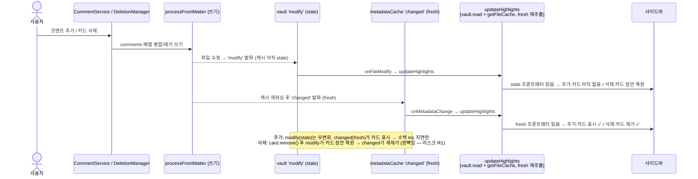

# fix: 파일 레벨 코멘트 동기화 3건 수정 (구현 계획)

- **원본 설계**: `docs/superpowers/specs/2026-06-23-file-comment-sync-fixes-design.md` (승인됨)
- **선행 기능**: `docs/plans/2026-06-23-001-feat-file-comment-frontmatter-storage-plan.md`
- **브랜치**: `feat/file-comment-frontmatter`
- **유형**: 버그 수정 (3건)
- **깊이**: Standard (4 구현 유닛, 6 파일)
- **실행 자세**: 순수 쓰기 계층(U3)은 test-first(vitest), 뷰 레이어(U1·U2·U4)는 수동 런타임 검증(프로젝트 관행 — 원본 §7)

---

## Context (왜 이 변경인가)

선행 작업(`feat/file-comment-frontmatter`)에서 **파일 레벨 코멘트**(노트 프론트매터 `comments` 키, `{text, ts}` 배열)를 도입한 뒤 수동 테스트에서 버그 3건이 발견됐다. systematic-debugging으로 근본 원인을 모두 규명했고(원본 §2), 사용자 런타임 증거로 초기 가설(인용부호·파서 문제)은 **반증**됐다.

원본 §2의 진단은 코드로 재검증됐다:

- **이슈 2 (추가 후 미표시) + 이슈 3a (수동 삭제 미반영)** — **metadataCache staleness**. 프론트매터 쓰기 직후 `vault.on('modify')` 핸들러가 아직 재파싱되지 않은 `metadataCache`를 읽어 인메모리 모델을 덮어쓴다. 파일 전환/리로드 시 fresh 캐시로 다시 추출돼 표시되는 것이 "다른 노트 갔다 오면 보임"의 정체다. `metadataCache.on('changed')` 구독은 **현재 코드 어디에도 없다**(grep 0건).
- **이슈 3b (카드 전체 삭제가 프론트매터 미반영)** — staleness와 **별개의 독립 버그**. `HighlightDeletionManager.deleteHighlight`에 파일 레벨(`position === -1`) 분기가 없어, 본문 포맷 제거(`removeHighlightFromFile`, text=''·position=-1이라 no-op)와 repo 항목 제거(`removeHighlight`, virtual 카드는 repo에 없어 no-op)만 하고 **프론트매터 `comments`는 전혀 건드리지 않는다**. 그런데도 "성공" 토스트가 표시된다.

**목표**: 추가·수동 삭제·카드 삭제가 모두 프론트매터 `comments`와 리로드 없이 정합한다. (이슈 1 모달 UI는 이미 별도 커밋으로 완료 — 본 계획 범위 외.)

---

## 요구사항 추적

| 이슈 | 근본 원인 | 설계 결정 | 유닛 | 검증 |
|---|---|---|---|---|
| 이슈 2 — 추가 후 미표시 | staleness + 낙관적 푸시가 stale `modify` 재추출에 덮임 | D1 | U1, U2 | 런타임 ① |
| 이슈 3a — 수동 프론트매터 삭제 미반영 | staleness, `'changed'` 트리거 부재 | D1 | U1 | 런타임 ② |
| 이슈 3b — 카드 전체 삭제가 프론트매터 미반영 | `deleteHighlight`에 `position === -1` 분기 없음 | D2 | U3, U4 | 단위(U3) + 런타임 ③ |

설계 결정(원본 §3):
- **D1** — 프론트매터를 파일 레벨 코멘트의 **단일 진실의 원천**으로 삼고 `metadataCache.on('changed')`를 **권위 있는 갱신 트리거**로 사용한다. 인라인 본문 하이라이트는 본문에서 읽으므로 `vault.on('modify')`는 **유지**한다(`'changed'`는 추가, 교체 아님). 낙관적 인메모리 푸시는 제거해 단일 경로화한다.
- **D2** — `position === -1` 통합 카드 전체 삭제 = 그 파일의 HiNote 파일 레벨 코멘트 **전부**를 프론트매터에서 제거(foreign 항목 보존). 개별 코멘트 삭제 경로(`deleteFileLevelCommentAt`)는 그대로 공존. 성공 시에만 정확한 토스트.

---

## 핵심 기술 결정 (KTD)

### KTD1 — `metadataCache.on('changed')`는 **추가(additive)** 트리거, `vault.on('modify')` 유지

`'changed'`는 캐시 재파싱 **후** 발화하므로 fresh 프론트매터를 보장한다. `vault.on('modify')`는 인라인 본문 하이라이트 갱신에 여전히 필요하므로 **제거하지 않는다**. 두 구독 모두 동일한 `EventCoordinator` 컨벤션(`component.registerEvent(ref)` + `eventRefs.push(ref)`)을 따르고, 동일한 가드(`file === getCurrentFile() && !isDraggedToMainView() && file instanceof TFile`)와 동일 콜백(`updateHighlights`)을 사용한다.

**Arity 주의**: `vault.on('modify')`는 `(file)`, `metadataCache.on('changed')`는 `(file, data, cache)` 시그니처다. 가드는 `file`에만 적용하되 `(file)` arity를 맹목 복사하지 말 것.

**fresh-read 체인 검증(end-to-end, 검증됨)** — `'changed'` → `updateHighlights`가 정말 fresh를 읽는가:
- `HighlightListController.updateHighlights` → `HighlightDataService.loadFileHighlights`는 `await this.app.vault.read(file)`로 **본문을 직접 읽고**(메모이즈 `getCachedFileContent` 경유 안 함) → `HighlightService.extractHighlights` → `HighlightExtractor.extractFileLevelComments(file)`는 `this.app.metadataCache.getFileCache(file)`를 **직접** 읽는다.
- 따라서 `'changed'` 시점에 본문·프론트매터 둘 다 fresh. **추가 캐시 무효화 불필요.**
- `HighlightExtractor`의 `contentCache`/`invalidateContentCache`는 **전역 인덱스 경로(HighlightIndexer) 전용**이며 현재 파일 뷰 경로엔 관여하지 않는다. (이것이 `HighlightIndexFileWatcher` 범위 배제의 근거이기도 하다.)

### KTD2 — `deleteAllFileLevelComments`는 **try/catch 형태**, `mergeFileLevelComments(existing, [])`

`InlineCommentWriter`에는 두 쓰기 패턴이 공존한다: `addFileLevelComment`의 **try/catch**(앵커 없음)와 `deleteFileLevelCommentAt`의 **`ok`-플래그/앵커 검사**. 전체 삭제는 검사할 앵커가 없으므로 **try/catch 형태**(`addFileLevelComment` 미러)를 쓴다. 쓰기는 `fm.comments = mergeFileLevelComments(existing, [])` — foreign(비-`{text,ts}`) 항목만 남기고 HiNote 항목 전부 제거. 순수 동작은 `test/inline/FrontmatterComments.test.ts`의 `'removes all HiNote items when newComments is empty'`로 이미 증명됨.

### KTD3 — `position === -1` 분기는 **early return**, 의존성은 `new InlineCommentWriter(app)`

분기는 확인 모달 **이후**, `if (highlight.filePath)` **이전**에 삽입하고 early return한다. 빈 텍스트(`text:''`) 카드가 기존 경로를 타면 `removeHighlightFromFile`이 빈 문자열 하이라이트를 stripping(파일 훼손/no-op)하고 `removeHighlight`가 비-하이라이트를 조작하므로, **두 호출 모두를 단락**해야 한다. `HighlightDeletionManager`는 `this.plugin`만 보유하고 `InlineCommentWriter`는 app-only 의존이므로 `new InlineCommentWriter(this.plugin.app)`로 생성한다(`CommentService`가 쓰는 동일 패턴 — 최소 결합).

### KTD4 — 신규 단위 테스트는 `InlineCommentWriter.fileLevel.test.ts`에 배치 (원본 대비 정정)

원본 §7·§9는 `test/inline/InlineCommentWriter.test.ts`를 명시했으나, 실제로는 파일 레벨 전용 테스트 파일 `test/inline/InlineCommentWriter.fileLevel.test.ts`가 존재하며 `mkApp`/`mkFile`/`seed` 모킹 헬퍼와 `deleteFileLevelCommentAt` describe 블록을 이미 갖추고 있다. 신규 `deleteAllFileLevelComments` 테스트는 이 파일에 추가한다.

---

## High-Level Technical Design

추가/삭제 시 `modify`(stale)와 `changed`(fresh) 이벤트가 **둘 다** `updateHighlights`를 호출하는 순서가 이 설계의 비자명한 핵심이다(아래는 방향성 안내이며 구현 명세가 아니다).



---

## 구현 유닛

### U1. `metadataCache.on('changed')` 구독 + 콜백 배선 (이슈 2·3a)

- **Goal**: 프론트매터 변경 시 fresh 재추출을 트리거하는 권위 있는 구독을 신설하고, 기존 `updateHighlights` 새로고침 경로에 배선한다. `vault.on('modify')`는 유지(KTD1).
- **Requirements**: 이슈 2(D1), 이슈 3a(D1).
- **Dependencies**: 없음.
- **Files**:
  - `src/views/managers/EventCoordinator.ts` (수정 — 인터페이스 + 등록 메서드 + 호출)
  - `src/views/hinote/HiNoteViewEventBindings.ts` (수정 — 콜백 배선)
- **Approach**:
  - `EventCallbacks`에 `onMetadataChange?: (file: TFile, isInCanvas: boolean) => void` 추가.
  - private `registerMetadataChangeEvent(getCurrentFile, isDraggedToMainView)` 신설 — `registerFileModifyEvent`를 미러. `this.app.metadataCache.on('changed', (file) => {...})`, 가드(`file === getCurrentFile() && !isDraggedToMainView() && file instanceof TFile`), `isInCanvas` 동일 계산, `this.callbacks.onMetadataChange?.(file, isInCanvas)`. 정리는 `component.registerEvent(ref)` + `eventRefs.push(ref)`.
  - `registerAllEvents`에 `registerMetadataChangeEvent(getCurrentFile, isDraggedToMainView)` 호출 추가.
  - `HiNoteViewEventBindings.setCallbacks`에 `onMetadataChange: (file, isInCanvas) => { fileListManager.invalidateCache(); void highlightListController.updateHighlights(isInCanvas); }` 추가(`onFileModify` 미러).
- **Patterns to follow**: `EventCoordinator.registerFileModifyEvent`, `HiNoteViewEventBindings`의 `onFileModify` 콜백.
- **Execution note**: 뷰 레이어 이벤트 배선 — 자동 단위 테스트 비현실적(기존 커버리지 0, 무거운 Obsidian 모킹 필요). 검증은 수동 런타임(프로젝트 관행, 원본 §7).
- **Test scenarios** (수동 런타임):
  - Covers 이슈 2 (부분): 파일을 연 상태에서 "Add file comment"로 코멘트 추가 → 리로드/파일 전환 없이 수백 ms 내 통합 카드가 사이드바에 표시.
  - Covers 이슈 3a: 같은 파일의 프론트매터 `comments`를 에디터에서 수동 삭제 → 리로드 없이 사이드바 카드가 사라짐.
  - 드래그 가드: 메인뷰로 드래그된 상태(`isDraggedToMainView`)에서는 갱신 콜백 미호출.
  - 비-현재 파일: 다른 파일의 프론트매터 변경 시 현재 뷰 갱신 없음.
  - unload: 뷰 닫기/리로드 시 리스너 누수 없음(`registerEvent` 등록).

### U2. 낙관적 인메모리 푸시 제거 (이슈 2)

- **Goal**: `onAddFileComment` 성공 후의 인메모리 카드 push/render 블록을 제거해 D1 단일 경로화한다. 새 코멘트 렌더는 U1의 `'changed'` 재추출에 위임한다.
- **Requirements**: 이슈 2(D1).
- **Dependencies**: **U1** — 낙관적 푸시를 제거하면 새 코멘트를 그릴 주체가 `'changed'` 재추출뿐이므로 U1이 선행해야 한다.
- **Files**:
  - `src/views/hinote/HiNoteViewSetup.ts` (수정)
- **Approach**:
  - `createFileCommentButton`의 `onAddFileComment` 콜백에서 `addFileLevelComment` 성공 확인(`if (!r.success) { Notice; return; }`) **이후**의 낙관적 블록(`const now = Date.now();` ~ `highlightListController.renderHighlights(state.highlights);`) 전체를 제거. 성공 시 그대로 반환(`'changed'`가 갱신). 실패 시 Notice는 유지.
  - **고아 import 정리**(boundaries 준수): 블록 제거 후 이 파일에서 미사용이 되는 `import { IdGenerator } ...`(현 line 12)와 `import type { CommentItem, HighlightInfo } ...`(현 line 14) 두 줄 제거. `Notice`(현 line 104 사용)는 유지.
- **Patterns to follow**: 인라인 경로의 단일-소스(write → 이벤트 재추출) 흐름.
- **Execution note**: 뷰 레이어 — 수동 런타임 검증. import 정리 후 **`eslint ./src/`로 미사용 import 확인**(`npm run build`의 tsc는 `noUnusedLocals` 미설정이라 고아 import를 잡지 못함 — `@typescript-eslint/no-unused-vars`가 잡는다), `npm run build`로 컴파일·타입 확인.
- **Test scenarios** (수동 런타임 + 정적 검사):
  - Covers 이슈 2 (완성): U1과 결합 시, 코멘트 추가 → 낙관적 즉시 렌더 없이 `'changed'` 경로로만 카드 표시. "추가 직후 잠깐 보였다 사라짐" 재현 안 됨.
  - 추가 실패 경로: `addFileLevelComment` 실패 시 실패 Notice 유지(낙관적 카드 없음).
  - 정적 검사: `eslint ./src/` 통과(미사용 import 0), `npm run build` 통과(컴파일·타입 오류 없음).

### U3. `InlineCommentWriter.deleteAllFileLevelComments` 신설 + 단위 테스트 (이슈 3b 프리미티브)

- **Goal**: 파일의 HiNote 파일 레벨 코멘트 전부를 프론트매터에서 제거하되 foreign 항목을 보존하는 쓰기 프리미티브. `{success, reason}` 반환.
- **Requirements**: 이슈 3b(D2) — 삭제 프리미티브.
- **Dependencies**: 없음(U4와 독립적으로 먼저 완성 가능).
- **Files**:
  - `src/services/comment/inline/InlineCommentWriter.ts` (신규 메서드)
  - `test/inline/InlineCommentWriter.fileLevel.test.ts` (신규 테스트 — KTD4)
- **Approach** (방향성 스케치, 구현 명세 아님):
  ```ts
  async deleteAllFileLevelComments(file: TFile): Promise<WriteResult> {
      try {
          await this.app.fileManager.processFrontMatter(file, (fm) => {
              const existing = Array.isArray(fm.comments) ? fm.comments : [];
              fm.comments = mergeFileLevelComments(existing, []);
          });
          return { success: true };
      } catch (e) {
          return { success: false, reason: e instanceof Error ? e.message : 'write failed' };
      }
  }
  ```
  - try/catch 형태(KTD2). 앵커 검사 없음(전체 삭제). foreign 보존은 `mergeFileLevelComments`가 보장.
- **Patterns to follow**: `InlineCommentWriter.addFileLevelComment`(try/catch), `deleteFileLevelCommentAt`(`mergeFileLevelComments` 사용). 테스트: 기존 `mkApp`/`mkFile`/`seed` 헬퍼.
- **Execution note**: **test-first** — 실패하는 단위 테스트 먼저 작성(vitest 인프라·모킹 패턴 존재).
- **Test scenarios** (vitest, `test/inline/InlineCommentWriter.fileLevel.test.ts`):
  - HiNote 항목만 존재 → `getFm().comments`가 `[]`, `success: true`. (키 삭제가 아니라 빈 배열 — `deleteFileLevelCommentAt`의 마지막 항목 삭제와 일관.)
  - **foreign 보존**: seed `[{note:'foreign'}, {text:'a', ts:'2026-06-23 10:00'}, {text:'b', ts:'2026-06-23 10:01'}]` → 결과 `[{note:'foreign'}]`, `success: true`.
  - `comments` 키 없음/빈 배열 → `success: true`, no-op(graceful).
  - `processFrontMatter`가 throw(mock을 reject로 오버라이드) → `success: false`, `reason` 포함(에러 경로).

### U4. `HighlightDeletionManager.deleteHighlight`에 `position === -1` 분기 (이슈 3b)

- **Goal**: 통합 카드 전체 삭제 시 본문/repo 제거를 단락하고 `deleteAllFileLevelComments`를 호출한 뒤 early return. 성공 시에만 정확한 토스트, 실패 시 실패 토스트.
- **Requirements**: 이슈 3b(D2).
- **Dependencies**: **U3** — `deleteAllFileLevelComments` 필요.
- **Files**:
  - `src/views/highlight/actions/HighlightDeletionManager.ts` (수정)
- **Approach** (방향성 스케치):
  ```ts
  // 확인 모달 블록 이후, `if (highlight.filePath)` 이전
  if (highlight.position === -1) {
      const file = this.plugin.app.vault.getAbstractFileByPath(highlight.filePath ?? '');
      if (file instanceof TFile) {
          const r = await new InlineCommentWriter(this.plugin.app).deleteAllFileLevelComments(file);
          if (!r.success) {
              if (!skipNotice) new Notice(t('Failed to delete highlight: ') + (r.reason ?? ''));
              return false;
          }
      }
      if (!skipNotice) new Notice(t('Highlight deleted successfully'));
      return true; // removeHighlightFromFile / removeHighlight / emitHighlightDelete 모두 단락
  }
  ```
  - `InlineCommentWriter` import 추가. `new InlineCommentWriter(this.plugin.app)`(KTD3).
  - 실패 시 false 반환 → 호출부(`HighlightCard.handleDeleteHighlight`)가 카드를 제거하지 않음(기존 동작).
  - **토스트 문구**: 위 스케치는 기존 `t('Highlight deleted successfully')` 키를 재사용하지만, 이는 "highlight"라 파일 코멘트 맥락에 부정확하다(D2 "정확한 토스트"와 모순). 성공 토스트는 파일 코멘트용 메시지(예: `t('File comment deleted successfully')`)를 쓰되, 신규 i18n 키 필요 여부는 구현 시 `i18n` 사전을 점검해 결정. 실패 토스트(`t('Failed to delete highlight: ')`)는 개발자 대면 문자열로 수용 가능.
- **Patterns to follow**: 기존 `if (highlight.filePath)` 블록의 토스트/Notice·try/catch, `CommentService`의 `new InlineCommentWriter(app)`.
- **Execution note**: 뷰/플러그인 의존(Notice·confirmModal) — 단위 테스트 비현실적(커버리지 0). 검증은 프리미티브(U3) 단위 테스트 + 수동 런타임(③).
- **Test scenarios** (수동 런타임 + U3 단위 의존):
  - Covers 이슈 3b: 통합 카드 ⋯ 메뉴 → 삭제 → 확인 모달 승인 → 프론트매터 `comments`에서 HiNote 코멘트 전부 제거 + 사이드바 카드 사라짐(`'changed'` 정합) + 정확한 성공 토스트.
  - 실패 경로: `deleteAllFileLevelComments` 실패 → 실패 토스트, 카드 잔존(false 반환).
  - foreign 보존: 프론트매터에 타 플러그인 `comments` 항목이 있을 때 그 항목 보존(U3 단위 테스트가 보장; 런타임에서 spot-check).
  - 회귀 — 개별 코멘트 삭제: 코멘트 더블클릭 → 편집창 삭제(`deleteFileLevelCommentAt`) 경로 영향 없음.
  - 회귀 — 일반 하이라이트: `position >= 0` 하이라이트 삭제는 기존 경로(`removeHighlightFromFile` + `removeHighlight`) 그대로.

---

## 범위 경계

### In scope
- 이슈 2(U1+U2), 이슈 3a(U1), 이슈 3b(U3+U4).

### 이미 완료 (범위 외)
- 이슈 1 — "Add file comment" 모달 textarea UI(`styles.css`). 별도 커밋으로 완료(원본 §2 이슈 1).

### Deferred to Follow-Up Work
- **전역 '모든 하이라이트' 인덱스 staleness** — `HighlightIndexFileWatcher`(전역 인덱스 surface)는 동일한 staleness 가능성이 있으나 보고된 증상이 없어 본 계획 범위 외(사용자 확인). 전역 뷰 staleness가 실제 관측되면 별도 후속.
- **`modify`/`changed` 디바운싱** — 프론트매터 쓰기마다 이중 추출(R2)이 성능 문제로 관측될 때만(원본 §8).
- **삭제 깜빡임(R1) 완화** — 매뉴얼 테스트에서 거슬릴 경우, frontmatter-only `modify` 단락 처리 또는 디바운싱을 후속으로.

### Outside this product's identity (원본 §8)
- 파일 레벨 카드 per-comment vs all 삭제 UX 재설계.
- 플래시카드 저장(`.hinote/flashcards/`) 변경.
- `parseFileLevelComments`/`isFileLevelComment` 변경 — 이슈 2는 파서 문제가 아니며, 변경 시 타 플러그인의 `comments` 데이터 훼손 위험.

---

## 리스크 및 의존성

- **R1 — 삭제 시 카드 깜빡임(self-correcting transient)**: 카드 삭제 시 `card.remove()` 직후 stale `vault.on('modify')` 재추출이 카드를 **잠깐 다시 그렸다가**, `'changed'`가 fresh 읽기로 다시 제거한다. 매뉴얼 테스터가 "수정 실패"로 오해할 수 있으므로 런타임 테스트 ③ 해석 시 명시한다. 수용된 트레이드오프(D1 지연 허용 + §8 디바운싱 YAGNI). → Deferred 완화.
- **R2 — 이중 추출**: 프론트매터 쓰기마다 `modify`+`changed` 둘 다 `updateHighlights`를 발화해 추출이 2회 일어난다. 성능 문제 관측 전까지 수용(원본 §8). → Deferred 디바운싱.
- **R3 — 추가 표시 지연**: 낙관적 푸시 제거(U2)로 새 카드는 `modify`→캐시→`changed` 체인 후(수백 ms) 표시된다. 사용자 수용(원본 D1). 과거 학습(`comment-insert-position-coordinate-desync.md`)이 디바운스 반영 지연(~1–2s)을 기록 — 동일 성격.
- **의존성**: U2 → U1, U4 → U3. (U1·U3는 상호 독립 — 두 트랙 병행 가능.)

---

## 미해결 / 구현 시 결정

- **`emitHighlightDelete` 발화 여부 (U4)**: `position === -1`에는 실제 하이라이트가 없으므로 **기본값은 발화 안 함**(early return으로 단락). 리뷰에서 현 `highlight:delete` 소비자 2개를 검증 — `FlashcardEventSyncService.handleHighlightDelete`(→ `deleteCardsBySourceId`; 파일 레벨 카드는 플래시카드가 없어 no-op), `HighlightDecorator.registerRefreshEvents`(→ `refreshDecorations`; 파일 레벨 코멘트는 본문 데코레이션이 없어 no-op). **둘 다 no-op이므로 skip 안전**(아래 flashcard 부재 가정에 종속). 전역 인덱스 갱신은 범위 외.
- **flashcard 선삭제 (U4)**: `HighlightCard.handleDeleteHighlight`의 `if (this.hasFlashcard)`는 파일 레벨 카드(text=''·position=-1)에서 항상 false → no-op. **변경 불필요**(구현 시 재확인). 미래에 파일 레벨 카드에 플래시카드가 연결되면 위 `emitHighlightDelete` skip을 재검토해야 함.
- **`updateHighlights` 재진입 안전성 (U1)**: 같은 파일에 `modify`와 `changed`가 연속 발화하면 `updateHighlights`가 중첩 호출된다(현재 별도 가드 없음). 중첩 호출이 torn render 없이 안전한지 구현 시 확인.
- **삭제 깜빡임 완화는 조건부 (R1, U4)**: 완화 보류를 **무조건이 아니라 조건부**로 둔다 — 런타임 테스트 ③에서 modify→changed 간격 동안 카드가 지각 가능 시간(대략 100~300ms) 이상 다시 보이면, 완화(frontmatter-only `modify` 단락 또는 디바운싱)를 보류 → in-scope로 승격. 그 이하면 보류 유지.
- **추가 중 인-플라이트 피드백 / 중복 제출 (R3, U2)**: 낙관적 카드 제거로 추가~표시 사이 사이드바에 아무 변화가 없다. "Add file comment" 버튼을 async write~`'changed'` 동안 비활성/진행 표시할지(중복 제출 방지) 또는 무피드백 + 최대 허용 지연 명시할지 구현 시 결정. 런타임 테스트 ①에서 체감 지연을 기록.
- **확인 모달 문구 (U4)**: 파일 코멘트 맥락에 맞게 조정 가능(선택, 필수 아님). 파괴적 동작이므로 확인 단계 자체는 유지.

---

## 테스트 전략

- **단위 (vitest)**: U3 `deleteAllFileLevelComments` 4 시나리오(전부 제거→`[]`, foreign 보존, 빈/무 키 graceful, throw 에러 경로). 순수 merge는 `FrontmatterComments.test.ts`로 이미 증명 — 신규 순수 테스트 불필요.
- **런타임 (수동, 프로젝트 관행 — 원본 §7)**:
  - ① 추가 → 리로드 없이 표시(U1+U2).
  - ② 수동 프론트매터 삭제 → 리로드 없이 반영(U1).
  - ③ 카드 삭제 → 프론트매터 반영 + 사이드바 정합(U3+U4). R1 깜빡임 관찰 메모.
- **회귀**: `parseFileLevelComments`/`mergeFileLevelComments`/`InlineCommentWriter.fileLevel`/`FrontmatterComments` 기존 테스트 녹색 유지. 개별 코멘트 삭제·일반 하이라이트 삭제 경로 무변화.
- **정적 검사/빌드**: `eslint ./src/`로 U2 고아 import 정리 확인(`npm run build`의 tsc는 `noUnusedLocals` 미설정이라 미사용 import를 못 잡음), `npm run build`(esbuild + tsc)로 컴파일·타입 확인.

---

## 출처 및 연구

- **Origin**: `docs/superpowers/specs/2026-06-23-file-comment-sync-fixes-design.md` (승인된 설계, 진단 §2 / 결정 §3).
- **선행 기능**: `docs/superpowers/specs/2026-06-23-file-comment-frontmatter-storage-design.md`, `docs/plans/2026-06-23-001-feat-file-comment-frontmatter-storage-plan.md`.
- **과거 학습 (docs/solutions/)**:
  - `architecture-patterns/file-comment-frontmatter-storage-pattern.md` — foreign 보존(`mergeFileLevelComments`), 삭제 후 ordinal 재번호 가드(undefined `fileCommentIndex` 건너뜀), no-silent-write 앵커 규칙. 본 계획의 직접 토대.
  - `logic-errors/comment-insert-position-coordinate-desync.md` — 스냅샷 staleness 클래스. 이 문서 line 69의 "사이드바는 `vault.read`로 디스크와 동일 좌표계" 주장은 **하이라이트 위치 좌표**에 관한 것이며 본 수정(프론트매터 트리거 추가)과 **무모순**. 본 수정은 컨벤션을 뒤집지 않고 프론트매터용 트리거(`'changed'`)를 **추가**한다.
  - `logic-errors/reading-mode-highlight-stale-range-global-uniqueness.md` — "한 스냅샷 좌표를 다른 스냅샷에 매핑하지 말라", "매치 실패는 가시적 Notice — 조용한 쓰기 금지". 삭제 경로 실패 시 Notice 규칙으로 반영.
- **코드 검증 (CodeGraph + Read)**: `loadFileHighlights`(`vault.read` 직접) → `extractHighlights` → `extractFileLevelComments`(`metadataCache.getFileCache` 직접) 체인으로 `'changed'` fresh 보장 확인. `HighlightIndexFileWatcher`는 전역 인덱스 전용(`invalidateContentCache`)으로 현재 뷰 경로와 무관 — 범위 배제 근거.
- **외부 연구**: 미수행. 내부 리팩터이고 이벤트 등록·프론트매터 CRUD·삭제 흐름 모두 강한 로컬 패턴이 존재하여 Phase 1.2에서 skip(고위험 외부 surface 없음).
