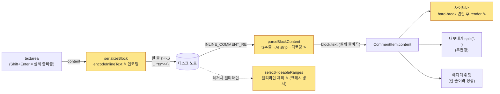

# fix: 코멘트 줄바꿈 지원 (인코딩 경계 단일화) — 구현 플랜

**Origin:** `docs/superpowers/specs/2026-06-24-comment-newline-design.md` (status: approved)
**Plan type:** `fix` · **Depth:** Standard
**Canonical build 파일명(저장 시):** `docs/plans/2026-06-24-001-fix-comment-newline-encoding-plan.md`

---

## Context (왜 이 변경인가)

코멘트에 줄바꿈을 넣으면 화면이 "깨진다". 인라인 코멘트는 노트 본문에
CriticMarkup `{>>코멘트 ^YYYY-MM-DD HH:mm:ss^<<}` 한 블록으로 저장되는데,
줄바꿈이 들어가면 블록이 여러 줄에 걸치며 세 표면이 동시에 깨진다(스펙 §2):

1. **에디터 데코레이션 크래시(핵심, 기본 설정에서 항상 발생)** — 기본값
   `showInlineCommentSyntax: false`(`src/types/settings.ts:89`, 확인됨)에서
   `EditorHighlightDecorations.buildDecorations`가 원시 블록을
   `Decoration.replace({})`로 숨긴다. CodeMirror 6의 ViewPlugin replace
   데코레이션은 줄바꿈을 넘을 수 없어, 멀티라인 범위가 들어가면 데코레이션
   빌드가 깨진다.
2. **사이드바 soft-break(2차)** — `CommentList`가 `MarkdownRenderer.render`로
   렌더하는데 CommonMark에서 단일 `\n`은 공백으로 병합 → "줄바꿈 인식 안 됨".
3. **직렬화가 줄바꿈을 그대로 디스크에 저장** — 위 두 문제의 근본 입력.

**목표 동작(D1):** 줄바꿈을 지원하되 **디스크에는 한 줄로 저장(인코딩)**, 화면에는
여러 줄로 표시(디코딩). 입력 경로는 이미 동작한다 — 코멘트 textarea는 Shift+Enter로
실제 줄바꿈 입력을 허용하고 평문 Enter만 저장으로 가로챈다
(`src/components/comment/CommentInputKeyboard.ts:23`, 확인됨). 따라서 이 플랜은
**저장·표시·에디터 견고성**만 고친다.

### 핵심 원리 — 단일 인코딩 경계 (스펙 §3)

> 디스크의 인라인 `{>>...<<}` 블록만 `\n`/`\\` 토큰을 가진다. 인메모리
> `CommentItem.content`는 **항상** 실제 줄바꿈을 가진다. 인코딩은
> `serializeBlock`(쓰기) **한 곳**, 디코딩은 `parseBlockContent`(읽기)
> **한 곳**에서만.

이 불변식은 추적으로 검증됨(아래 §System-Wide Impact): 모든 쓰기는
`serializeBlock`을 거치고, 모든 읽기는 `parseInlineComments` →
`parseBlockContent`를 거친다.

---

## Requirements (origin 추적)

| # | 요구 | 근거(origin) |
|---|------|------|
| R1 | 줄바꿈을 한 줄(`\n` 토큰)로 인코딩해 디스크에 저장 | D1, D2, §4-1 |
| R2 | 디스크 한 줄 블록을 실제 줄바꿈으로 디코딩 (1회 좌→우 스캔, 전단사) | D2, §4-2 |
| R3 | 사이드바에서 줄바꿈이 시각적으로 보이도록 hard break 변환 | §4-3 |
| R4 | 멀티라인 레거시 블록이 에디터 데코레이션을 크래시시키지 않음 (A2 가드) | D4, §4-4 |
| R5 | 백슬래시 하위 호환 주의 문서화 (마이그레이션 없음) | D3, §4-5 |

**비범위(스펙 §8):** 백슬래시 하위 호환 마이그레이션(D3), `<<}` ZWNJ 라운드트립
수정(D5), 에디터 StateField 이전(B안), 프론트매터·내보내기 코드 변경
(무변경 확인됨, 아래).

---

## High-Level Technical Design — 인코딩 경계

> 방향성 안내(리뷰용). 디스크 표현과 인메모리 표현의 단일 변환 지점을 표시한다.

`✎` = 이번 플랜이 손대는 4개 지점. 인코딩(`serializeBlock`)·디코딩
(`parseBlockContent`) 각각 단 한 곳.

---

## Key Technical Decisions

- **KTD-A. 인코딩 순서(전단사 보장):** `\` → `\\` **먼저**, 그다음 줄바꿈 →
  `\n`. 역순이면 새로 만든 `\n`의 백슬래시가 다시 이스케이프되어 깨진다.
  (origin D2)
- **KTD-B. 디코딩은 1회 좌→우 스캔(2-pass `.replace()` 금지):** `\\`→`\`,
  `\n`→줄바꿈을 **한 번의 스캔**으로 처리. 순차 `replace` 2번은
  `decode(encode("C:\nginx"))`에서 리터럴 백슬래시를 줄바꿈으로 오변환한다.
  그 외 `\x`(미정의 시퀀스)는 리터럴 유지. (origin D2)
- **KTD-C. 디코딩 위치 = 타임스탬프 추출·AI 접두 strip **후**:** 타임스탬프
  정규식 `TIMESTAMP_SUFFIX_RE`는 인코딩된 한 줄 content 말미 ` ^ts^`에 그대로
  매치되므로 **변경 불필요**(인코딩이 타임스탬프를 건드리지 않음 — 직렬화가
  `{>>${encode(text)} ^${ts}^<<}`로 encode 바깥에 ts를 붙임). (origin §4-2)
- **KTD-D. 에디터 가드 = 순수 함수로 멀티라인 제외(테스트 가능성 우선):**
  스펙 §4-4가 제시한 두 옵션 중 "`findInlineCommentRanges`에서 멀티라인 표시/제외"를
  채택. 신규 순수 함수 `selectHideableRanges(text)`가 멀티라인 범위를 걸러내고
  `buildDecorations`가 이를 소비한다. **이유:** vitest가 `@codemirror/view`를
  스텁으로 alias(`vitest.config.ts:15`)하므로 실제 `Decoration.replace`의
  RangeError가 발생하지 않는다 → 스펙 §7의 "실제 EditorView 마운트 시 크래시
  없음" 테스트는 **현 환경에서 달성 불가**. 대신 제외 결정을 순수 함수로 직접
  검증한다. (origin D4, §4-4)
- **KTD-E. 사이드바 변환도 순수 헬퍼로 추출:** `content.replace(/\n/g, '  \n')`를
  `CommentList` 인라인 대신 작은 순수 모듈로 분리해 단위 테스트. (origin §7
  "또는 순수 헬퍼")

---

## Implementation Units

### U1. 인라인 텍스트 인코딩 (쓰기)

- **Goal:** 코멘트 텍스트를 디스크 한 줄 블록으로 인코딩. (R1)
- **Dependencies:** 없음
- **Files:**
  - `src/services/comment/inline/InlineCommentSerializer.ts` (수정)
  - `test/inline/InlineCommentSerializer.test.ts` (확장)
- **Approach:** 기존 `sanitizeText`를 `encodeInlineText`로 확장(또는 신규 함수
  추가 후 `serializeBlock`이 호출). 순서(KTD-A): ① `\`→`\\` ② `\r\n`/`\r`/`\n`→`\n`
  ③ 기존 `<<}`→`<‌<}`(ZWNJ, 유지). `serializeBlock`은 항상 한 줄 블록을 산출.
  기존 insert/update/delete는 `serializeBlock`을 거치므로 자동 적용.
- **Patterns to follow:** 현 `sanitizeText`(`InlineCommentSerializer.ts:87`)의
  `String.replace` 스타일, 기존 `serializeBlock` 시그니처 유지.
- **Test scenarios:**
  - 단일 줄바꿈 포함 텍스트 → `\n` 토큰 1개, 결과 블록에 실제 줄바꿈 없음.
  - `\r\n`, `\r` 모두 `\n` 단일 토큰으로 정규화.
  - 리터럴 백슬래시 포함(`C:\nginx`) → `C:\\nginx`로 인코딩(백슬래시 먼저).
  - 백슬래시+줄바꿈 혼합(`a\` + 줄바꿈 + `b`) → `a\\\nb` (순서 정확성).
  - `<<}` 포함 → 기존 ZWNJ 이스케이프 유지(KTD1 회귀 없음).
  - `serializeBlock` 출력이 `\n`(실제 줄바꿈) 문자를 포함하지 않음(한 줄 보장).
  - 기존 AI 접두 `🤖 ` 통과 회귀 확인.
- **Verification:** `InlineCommentSerializer.test` 그린, 기존 직렬화 테스트 무회귀.

### U2. 인라인 블록 디코딩 (읽기)

- **Goal:** 디스크 한 줄 블록을 실제 줄바꿈 content로 디코딩. (R2)
- **Dependencies:** U1 (라운드트립 `decode(encode(x))===x` 테스트가 인코더 필요)
- **Files:**
  - `src/services/comment/inline/InlineCommentParser.ts` (수정)
  - `test/inline/InlineCommentParser.test.ts` (확장)
- **Approach:** `parseBlockContent`에서 **타임스탬프 추출·AI 접두 strip 후**
  단일 좌→우 스캔 디코더 추가(KTD-B): `\\`→`\`, `\n`→줄바꿈, 그 외 `\x`는
  리터럴. ZWNJ 복원은 D5에 따라 제외. `TIMESTAMP_SUFFIX_RE`·`INLINE_COMMENT_RE`
  변경 없음(KTD-C).
- **Execution note:** 차별 케이스(아래 3개)를 **RED 먼저** 작성 — 순차
  `.replace()` 2-pass나 잘못된 순서 구현을 실패시키는 것이 목적.
- **Patterns to follow:** 기존 `parseBlockContent`(`InlineCommentParser.ts:124`)의
  단계적 strip 스타일.
- **Test scenarios (차별 케이스 포함):**
  - 디스크 `C:\\nginx` → 디코딩 `C:\nginx`(리터럴 백슬래시-n 유지, 줄바꿈 아님).
  - 디스크 `line1\nline2` → 디코딩 `line1`⏎`line2`(토큰이 실제 줄바꿈으로).
  - **혼합 한 케이스:** content가 리터럴 `\` 뒤 실제 줄바꿈으로 끝나는 값
    → 인코딩→디코딩 라운드트립 동일(인코딩 순서 버그 검출).
  - 라운드트립: 백슬래시·줄바꿈·일반 텍스트 조합 다수에서 `decode(encode(x))===x`.
  - 레거시 **실제 줄바꿈** 블록(`{>>line1`⏎`line2 ^ts^<<}`) 파싱 → 줄바꿈 유지(안전).
  - 타임스탬프 + AI 접두 + 인코딩된 줄바꿈 동시 처리(strip 순서 정확).
  - `\x`(예: `\t` 같은 미정의 시퀀스)는 리터럴 `\t`로 유지.
- **Verification:** `InlineCommentParser.test` 그린, 기존 파서 테스트 무회귀.

### U3. 사이드바 hard-break 렌더

- **Goal:** 사이드바에서 코멘트 줄바꿈이 시각적으로 보이게. (R3)
- **Dependencies:** 없음 (U2가 content에 실제 줄바꿈을 채워주지만, 변환 헬퍼는 독립 테스트)
- **Files:**
  - `src/components/highlight/commentMarkdown.ts` (신규, 순수 헬퍼 — KTD-E)
  - `src/components/highlight/CommentList.ts` (수정: 렌더 전 변환 적용)
  - `test/components/commentMarkdown.test.ts` (신규)
- **Approach:** `toHardBreakMarkdown(content: string): string` =
  `content.replace(/\n/g, '  \n')`. `CommentList.renderComments`에서
  `MarkdownRenderer.render` 호출 직전 `const content = toHardBreakMarkdown(comment.content)`.
  단일 라인 코멘트는 `\n`이 없어 무영향(surgical). 렌더 실패 폴백(`textContent`)은
  변환 **전** 원본을 쓸지 변환본을 쓸지 — 폴백은 평문이므로 원본 `comment.content`
  유지(기존 동작 보존).
- **Patterns to follow:** 기존 `CommentList.ts:68-91` 렌더/폴백 구조.
- **Test scenarios:**
  - 단일 줄바꿈 → `  \n`(CommonMark hard break)로 변환.
  - 줄바꿈 없는 단일 라인 → 무변경(문자열 동일).
  - 다중 문단(`\n\n`) → 각 `\n`이 변환됨(**수용된 한계**: 이중 hard break로
    렌더됨을 명시적으로 단언).
  - 코드펜스 포함 content → fence 내부 줄바꿈도 변환됨(**수용된 한계**: D-레벨로
    스펙이 naive 변환을 수용; 테스트는 현 동작을 고정하고 한계를 문서화).
- **Verification:** `commentMarkdown.test` 그린. (실제 `MarkdownRenderer`는
  Obsidian 소관이라 순수 변환만 검증.)

### U4. 에디터 A2 가드 — 멀티라인 숨김 제외

- **Goal:** 멀티라인 레거시 블록이 데코레이션 빌드를 깨지 않음. (R4)
- **Dependencies:** 없음
- **Files:**
  - `src/editor/inlineCommentRanges.ts` (수정: `selectHideableRanges` 추가)
  - `src/editor/EditorHighlightDecorations.ts` (수정: 숨김 루프가 신규 함수 사용)
  - `test/editor/EditorHighlightDecorations.test.ts` (확장: `selectHideableRanges` describe)
- **Approach (KTD-D):** 신규 순수 함수
  `selectHideableRanges(text) = findInlineCommentRanges(text).filter(r => !text.slice(r.from, r.to).includes('\n'))`.
  `findInlineCommentRanges`는 **무변경**(기존 테스트 전부 그린 유지 — 멀티라인
  범위 포함 단언 보존). `EditorHighlightDecorations.ts:64`의
  `findInlineCommentRanges(docText)` → `selectHideableRanges(docText)` 한 줄 교체.
  위젯 생성 루프는 별개라 무영향 → 레거시 멀티라인 블록은 원시 노출되나
  크래시 없음, 편집·저장 시 U1 직렬화로 자연 정규화.
- **Patterns to follow:** 기존 `inlineCommentRanges.ts`의 순수 함수 스타일,
  기존 테스트 describe 구조.
- **Test scenarios:**
  - 단일 라인 블록 → `selectHideableRanges`에 포함(from/to 정확).
  - 멀티라인 블록(`{>>`⏎`...`⏎`<<}`) → 제외(결과에서 빠짐).
  - 단일+멀티라인 혼재 → 단일 라인 범위만 반환, 순서 보존.
  - 빈 문자열/블록 없음 → 빈 배열.
  - (회귀) 기존 `findInlineCommentRanges` 4개 테스트 전부 그린.
- **Verification:** `EditorHighlightDecorations.test` 그린.

### U5. 문서화 — README 하위 호환 주의

- **Goal:** 백슬래시 하위 호환 주의 명시. (R5)
- **Dependencies:** 없음
- **Files:** `README.md` (수정; 필요 시 설정 설명 1줄)
- **Approach:** 기존 코멘트에 리터럴 `\n`/`\\`가 있으면 새 디코더가 이를
  줄바꿈/백슬래시로 해석할 수 있음(희귀, 수용 — D3). 줄바꿈 입력 방법
  (Shift+Enter)도 함께 안내하면 사용자 가치↑.
- **Test scenarios:** 없음 — 문서 변경. `Test expectation: none -- 순수 문서.`
- **Verification:** README 렌더 확인(수동).

---

## System-Wide Impact — 단일 디코딩 경계의 파급

`parseBlockContent`가 유일 디코딩 지점이므로, `parseInlineComments`를 호출하는
**모든** 읽기 경로가 자동으로 디코딩된 content를 받는다. 추적 결과(확인됨):

- `HighlightExtractor.blockToCommentItem`(`:405`) → `block.text`를
  `CommentItem.content`로 매핑(AI 접두 재부착). 디코딩된 실제 줄바꿈이 인메모리로
  전파 — **의도된 동작**.
- `InlineCommentSerializer.findBlock`(`:126`) → 앵커 체크가 디코딩된 `c.text`를
  인메모리 `target.currentText`와 비교. 양쪽 모두 실제 줄바꿈 도메인 → **정합**.
  신규 블록은 `serializeBlock`로 재인코딩 → 라운드트립 일관.
- `InlineMigration.isAlreadyInlined`(`:162`) → `parseInlineComments`로 멱등성
  판정. 디코딩된 `c.text` vs 저장 `c.content`(실제 줄바꿈) 비교 → 양쪽 실제
  줄바꿈 도메인. 마이그레이션 쓰기는 `insertComment`→`serializeBlock`로 인코딩
  → **멱등성 보존**(코드 변경 불필요).

### 무변경 확인 표면 (origin §2 "영향 없는 표면", 본 조사로 재확인)

- **내보내기:** `ExportContentRenderer.formatComment`(`:63`)가 이미
  `content.split('\n')`으로 줄 단위 콜아웃 생성 → 실제 줄바꿈 content면 그대로 동작.
- **프론트매터 파일 레벨 코멘트:** `processFrontMatter`가 YAML로 실제 줄바꿈을
  안전 직렬화 → 저장 멀쩡, 표시는 U3로 커버.

---

## Edge Cases / Risks

- 기존 **실제 줄바꿈** 인라인 블록(레거시): 디코딩해도 줄바꿈 유지 → 안전.
- 기존 **리터럴 백슬래시**(`C:\nginx` 등): 새 디코더가 오해석 가능 → 수용·문서화(D3, U5).
- 레거시 멀티라인 블록(에디터): U4 가드로 크래시 없음, 편집 시 정규화(D4).
- 사이드바 hard-break의 naive 한계(코드펜스/이중 문단): 스펙 수용, U3 테스트로 고정·문서화.
- `<<}` ZWNJ 라운드트립 미수정(D5): 줄바꿈과 무관한 기존 잠재 버그, 비범위.

---

## Verification (end-to-end)

1. `npm test` (vitest) — 신규/확장 테스트 전부 그린, 기존 테스트 무회귀.
2. `npm run build` (`tsc -noEmit` 포함) — 타입 에러 0.
3. 수동(Obsidian): 코멘트에 Shift+Enter로 여러 줄 입력 → 저장 →
   (a) 디스크 노트에서 블록이 **한 줄**(`\n` 토큰)인지, (b) 사이드바에서 줄바꿈이
   보이는지, (c) 기본 설정에서 에디터가 크래시 없이 위젯을 표시하는지,
   (d) 내보내기 콜아웃이 줄 단위로 나오는지 확인.
4. 레거시 멀티라인 블록이 있는 노트를 열어 에디터 크래시 없음 확인.

---

## Sources & Research

- Origin 설계 스펙: `docs/superpowers/specs/2026-06-24-comment-newline-design.md`
- 코드 확인: `InlineCommentSerializer.ts`, `InlineCommentParser.ts`,
  `CommentList.ts`, `EditorHighlightDecorations.ts`, `inlineCommentRanges.ts`,
  `HighlightExtractor.ts:383-413`, `InlineMigration.ts:157-168`,
  `ExportContentRenderer.ts:55-74`, `settings.ts:88-89`,
  `CommentInputKeyboard.ts:12-29`
- 테스트 환경 제약: `vitest.config.ts:11-17`(`@codemirror/*`, `obsidian` 스텁 alias)
  → KTD-D의 근거.
