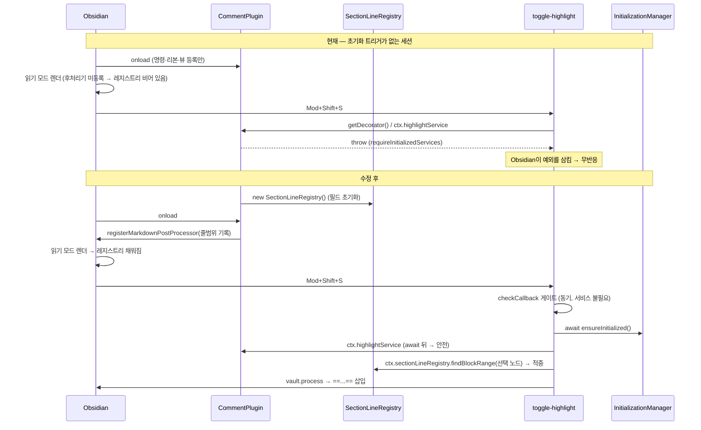

# Reading-mode Highlight Cold Start - Plan

## Goal Capsule

- **Objective**: 읽기 모드 하이라이트 단축키(`Mod+Shift+S`)가 서비스 지연 초기화 이전에도 첫 입력부터 동작하게 한다. 같은 원인으로 죽어 있는 `toggle-inline-comment-syntax`도 함께 고친다.
- **Authority hierarchy**: 이 계획 → `CLAUDE.md`/`AGENTS.md` 컨벤션 → 기존 코드 패턴. 충돌 시 이 계획이 우선하되, 계획이 침묵하는 곳은 저장소 컨벤션을 따른다.
- **Execution profile**: `superpowers:test-driven-development`. U2·U3는 콜드 스타트 실패 테스트(RED)를 먼저 세운다 — 기존 테스트는 서비스를 이미 초기화된 것으로 모킹해 이 버그를 구조적으로 잡지 못하므로, 통과하는 기존 스위트는 증거가 아니다.
- **Stop conditions**: 전체 서비스를 `onload`에서 초기화하려는 방향으로 드리프트하면 중단(R6 위반). `mapHighlightInsertion`의 문서 전역 유일성 게이트를 약화시켜야 통과하는 상황이면 중단.
- **Tail ownership**: 커밋·PR은 실행자 소유. `docs/solutions/`에 콜드 스타트 학습을 남길지는 작업 완료 후 별도 판단.

---

## Product Contract

### Summary

읽기 모드 블록의 소스 줄범위를 기록하는 후처리기를 플러그인 로드 시점으로 끌어올리고, 하이라이트 관련 두 명령이 실행 시점에 필요한 서비스를 지연 초기화하도록 바꾼다. 전체 서비스 즉시 초기화는 채택하지 않으므로 시작 비용은 후처리기 등록 한 건만 늘어난다.

### Problem Frame

플러그인은 지연 초기화 구조다. `main.ts`의 `onload()`는 명령·리본·뷰만 등록하고, 실제 서비스는 `ensureServicesInitialized()`가 처음 호출될 때 생성된다. 트리거는 사이드바 뷰 복원, 리본 아이콘, 설정 탭 진입, 코멘트 패널·메인 창·통계 대시보드 명령이며, 한 번 초기화되면 세션 내내 유지된다.

`toggle-highlight`와 `toggle-inline-comment-syntax`는 그 트리거 목록에 없다. 두 명령은 `ensureInitialized` 썽크를 받지 않고 `getDecorator()`만 받는데(`src/commands/index.ts:28,31`), 이 게터는 `main.ts`의 `requireInitializedServices()`를 타고 초기화 전에 예외를 던진다. Obsidian이 이 예외를 삼켜서 단축키가 무반응으로 보인다. `toggle-highlight`의 preview 분기는 `ctx.highlightService`도 함께 읽는데 이 역시 같은 게터 계열이다.

두 번째 원인은 등록 타이밍이다. `SectionLineRegistry`를 채우는 후처리기는 `HighlightDecorator.enable()` 안에 있고(`src/editor/HighlightDecorator.ts:99`), Obsidian의 `registerMarkdownPostProcessor`는 등록 이후의 렌더에만 적용된다. 초기화가 늦으면 이미 렌더된 읽기 모드 문서는 레지스트리에 없어 `findBlockRange`가 null을 반환하고 "블록 범위를 결정할 수 없음" Notice로 끝난다.

두 결함 모두 잠재된 것이지 회귀가 아니다. 지연 초기화 리팩터(`f377f76`, 2026-05-13)가 읽기 모드 하이라이트 기능(2026-06-21)보다 한 달 앞선다. 원본 계획은 지연 초기화를 한 번도 언급하지 않았고, 수동 검증 절차가 테스터를 설정 → 단축키 화면으로 먼저 보내 초기화를 이미 건드리게 만든 탓에 발견되지 않았다.

### Requirements

**콜드 스타트 동작**

- R1. 서비스 초기화 이전 상태에서 읽기 모드 문서에 `Mod+Shift+S`를 처음 눌렀을 때, 선택 텍스트가 `==...==`로 소스에 삽입된다.
- R2. 서비스 초기화 이전에 렌더된 읽기 모드 문서에서도 선택 노드의 블록 줄범위를 찾을 수 있다. **재시작 시 복원되는 노트를 포함한다** — 이것이 버그가 신고된 주 시나리오다. `onload`는 레이아웃 준비보다 먼저 완료되므로 복원된 렌더는 후처리기 등록 이후다. 플러그인 `onload` 자체보다 앞선 렌더(신규 설치·세션 중 활성화)만 범위 밖이다(Scope Boundaries 참조).
- R3. `toggle-inline-comment-syntax`가 초기화 이전에도 예외 없이 문법 표시를 토글한다.
- R4. 초기화가 실패하면 조용히 죽지 않고 Notice로 사용자에게 알린다.

**회귀 방지**

- R5. 소스 모드 분기(네이티브 `editor:toggle-highlight` 위임과 수동 폴백)의 현재 동작이 유지된다.
- R6. 플러그인 시작 비용은 후처리기 등록 한 건 외에 늘지 않는다. `onload`에서 서비스 그래프를 생성하지 않는다.
- R7. `mapHighlightInsertion`의 문서 전역 유일성 게이트가 그대로 유지된다.

### Scope Boundaries

#### Deferred to Follow-Up Work

- **`onload` 이전에 렌더된 문서.** 이 수정은 `onload` **이후**의 렌더를 덮는다. 재시작으로 복원되는 노트는 여기 **해당하지 않는다** — `onload`가 레이아웃 준비보다 먼저 끝나므로 복원 렌더는 등록 이후이고, R2가 덮는다. 남는 것은 플러그인이 이미 실행 중인 앱에 뒤늦게 붙는 경우뿐이다: 신규 설치 직후, 또는 세션 중 Settings → Community plugins에서 켤 때 읽기 모드 노트가 이미 열려 있으면 그 문서는 후처리기 등록 전에 렌더가 끝나 레지스트리에 없다. 해당 노트를 다시 열기 전까지 "블록 범위를 결정할 수 없음"이 뜬다. `MarkdownPreviewView.rerender()`로 닫을 수 있지만 선택 영역이 날아가므로 이 계획은 쓰지 않는다.
- **나머지 두 후처리기.** `HighlightDecorator.enable()`의 `hideInlineCommentBlocks`(`src/editor/HighlightDecorator.ts:93`)와 `processPreview`(`:109`)는 동일한 늦은 등록 결함을 공유한다. 초기화 전에 렌더된 문서에는 코멘트 블록 숨김과 하이라이트 위젯이 적용되지 않는다. 이번 범위 밖 — 이 계획은 단축키 경로만 고친다.

#### Outside this product's identity

원본 계획(`docs/plans/2026-06-21-001-feat-reading-mode-highlight-plan.md`)에서 이미 보류한 항목들이며 이 계획이 되살리지 않는다.

- 모바일·터치 트리거 (`registerToggleHighlightCommand`의 `Platform.isMobile` 조기 반환 유지)
- 다중 블록 선택
- 읽기 모드에서의 하이라이트 해제
- 인라인 마크다운의 정밀 리매핑

---

## Planning Contract

### Key Technical Decisions

- KTD1. **`SectionLineRegistry` 인스턴스는 `CommentPlugin`의 `readonly` 공개 필드 초기화식으로 만든다** — `onload` 본문이 아니라 인스턴스 생성 시점이다. `PluginServices`에 넣는 방법은 배제한다: 그 인터페이스는 정의상 초기화 후에만 존재하는 서비스 가방이고(`initManager.currentServices`는 초기화 전 `null`), 거기 두면 지금 고치려는 버그를 그대로 재생산한다. 평범한 필드는 던지는 게터가 아니므로 초기화 전에도 안전하다. `main.ts:23-32`의 다른 접근자들과 대비되는 지점이다.
- KTD2. **후처리기 등록은 `src/plugin/PluginBootstrap.ts`의 새 `registerPluginMarkdownPostProcessors(plugin)`가 맡는다.** `main.ts`는 수명주기만 담는다는 컨벤션(`CLAUDE.md`)에 맞춘다. `main.ts`는 필드 한 줄과 호출 한 줄만 늘어난다.
- KTD3. **`checkCallback`은 동기이므로 실행 분기에서 `void` async IIFE + `.catch()`로 비동기 작업을 띄운다.** 게이트(`getActiveViewOfType`)는 서비스가 필요 없어 sync/async 분리가 깔끔하다. 저장소의 6개 `addCommand` 중 `checkCallback`은 `toggle-highlight` 하나뿐이라 sync-gate + async-execute 선례가 없다. 이 계획이 그 선례를 만든다. 기존 `toggleHighlight.ts:66-68`의 `void ... .catch()` 스타일을 그대로 잇는다.
- KTD4. **`await ensureInitialized()` 이후 `ctx.highlightService`를 그대로 읽는다.** `main.ts:26`의 게터는 `requireInitializedServices().highlightService`, 즉 null 가드를 통과한 필드 읽기일 뿐 부수효과가 없다. 문제는 게터를 읽는 것이 아니라 **초기화 전에** 읽는 것이므로, `await` 뒤에서는 안전하다. 반환값을 스레딩하는 대안은 기각한다 — `src/commands/index.ts:18`의 공유 썽크가 `() => Promise<void>`로 선언돼 반환값을 버리고(`PluginBootstrap.ts:37`), 이를 넓히면 `openCommentPanel`·`openMainWindow`·`openStatsDashboard` 세 파일의 시그니처가 함께 깨진다(`Promise<PluginServices>`는 `Promise<void>` 파라미터에 대입 불가). 전용 썽크를 하나 더 만드는 우회도 있지만 썽크가 둘로 늘어날 뿐 사는 게 없다.
- KTD5. **하이라이트 인덱스 완성을 기다리지 않는다.** `HighlightService.shouldProcessFile`과 `extractHighlights`는 `HighlightExtractor`에 위임하며(`src/services/HighlightService.ts:48,52`) 인덱서를 거치지 않는다. `shouldProcessFile`은 확장자 검사와 제외 패턴 매칭뿐인 동기 함수이고, 설정은 `onload`에서 이미 로드된다. `InitializationManager.ts:65`의 `void highlightService.initialize()`가 짓는 것은 검색 인덱스이며 `getAllHighlightsFromCache`/`searchHighlightsFromIndex`만 소비한다. `ReadingModeHighlighter`는 인덱스를 건드리지 않는다.
- KTD6. **`hideInlineCommentBlocks`의 `sortOrder: 1`은 `enable()`에 그대로 둔다.** 이번 수정 대상이 아니고, "기본 후처리기보다 먼저 실행"이라는 명시적 우선순위가 동작에 관여한다. 레지스트리 후처리기를 `onload`로 옮겨도 `enable()`에 남는 두 후처리기와는 순서 다툼이 없다 — `processPreview`는 레지스트리를 읽지 않으므로(`src/views/highlight/preview/PreviewWidgetRenderer.ts`) 둘 사이에 write-before-read 관계가 애초에 존재하지 않는다. 레지스트리의 유일한 독자는 명령 실행 시점의 `ReadingModeHighlighter`이고, 그때는 렌더가 이미 끝나 있다.
- KTD7. **`onload`에서 전체 서비스를 초기화하는 대안을 기각한다.** 그 방법이면 단축키 두 개뿐 아니라 읽기 모드 위젯과 코멘트 블록 숨김까지 한 번에 살아나고 이 계획의 배선 작업 대부분이 사라진다. 기각 근거는 시작 비용이다 — `InitializationManager.initialize()`는 저장소 인덱스 구축, 데이터 로드, FSRS 관리자 생성까지 끌고 오는데, `CLAUDE.md`의 "시작을 가볍게 유지하고 무거운 작업은 지연" 지침과 정면으로 충돌한다. 플러그인을 설치만 하고 하이라이트를 안 쓰는 세션도 매번 그 비용을 내게 된다. 승격 대상을 후처리기 하나로 좁히면 지연 초기화 구조가 그대로 남는다. 대가는 위젯·코멘트 숨김이 초기화 전 문서에 여전히 적용되지 않는다는 것이며, 후속 작업으로 남긴다(Scope Boundaries 참조).

  중간 선택지 — `HighlightService`를 레지스트리와 함께 `onload` 필드로 승격 — 도 기각한다. KTD5가 보였듯 명령이 그 서비스에서 쓰는 표면은 인덱스와 무관해 기술적으로는 가능하고, 그러면 `await` 자체가 사라진다. 하지만 나머지 다섯 명령이 모두 `await ensureInitialized()` 계약을 쓰고 있어, 하이라이트 명령만 이탈하면 첫 입력 지연을 벌고 여섯 명령의 패턴 일관성을 잃는다.

### High-Level Technical Design

콜드 스타트 시퀀스의 변화가 이 계획의 핵심이다.

레지스트리는 `HighlightDecorator`를 완전히 떠난다. `enable()`에서 후처리기가 빠지고 나면 데코레이터에는 레지스트리 사용처가 하나도 남지 않으므로, 생성자로 주입해 봐야 소비자 없는 통과 필드가 된다. 대신 `HiNotePluginContext`에 레지스트리를 노출해 `toggleHighlight`가 직접 읽는다. 그 결과 `toggle-highlight` 경로에서 `getDecorator`가 통째로 사라지고, 던지는 게터가 배선 수준에서 제거된다.

`ReadingModeHighlighter`는 이미 레지스트리를 생성자 주입으로 받으므로(`src/services/highlight/ReadingModeHighlighter.ts:16`) 이 파일은 변경되지 않는다.

### Assumptions

- **`InitializationManager.initialize()`는 읽기 모드를 재렌더하지 않고 DOM 선택 영역을 건드리지 않는다.** 이 가정이 깨지면 콜드 스타트 첫 입력이 "No text selected"로 끝나 R1이 정확히 목표 시나리오에서 실패한다 — `ReadingModeHighlighter`가 `activeWindow.getSelection()`을 새로 삽입된 `await` **뒤에** 읽기 때문이다. `initialize()`가 부르는 `highlightDecorator.enable()`은 `registerEditorExtension`으로 CM6 소스 에디터만 확장하며 읽기 모드 DOM을 재구성하지 않는다. 자동 테스트는 `ReadingModeHighlighter` 생성을 모킹하므로 이 가정을 검증하지 못한다 — 수동 검증 5단계가 유일한 게이트다.
- **`InitializationManager.initialize()`는 현재 `await`가 하나도 없어 사실상 동기로 완료된다.** `PluginBootstrap.ts:15-16`이 `void ensureServicesInitialized()` 직후 `requireInitializedServices()`를 호출해도 동작하는 이유가 이것이다. **이 성질에 기대지 않는다** — 실행 시점 `await`는 지금은 마이크로태스크 한 번 값이지만, 나중에 `initialize()`에 `await`가 하나 들어가도 그대로 견딘다. 동기 초기화를 전제한 지름길(예: `checkCallback` 안에서 동기 초기화 유발)은 오늘은 통과하지만 부서지기 쉽다.

### Sequencing

U1 → U2 → U3. U2는 U1이 만든 레지스트리 배선에 의존한다. U3는 독립적이지만 U2가 세운 `ensureInitialized` 썽크 전달 패턴을 따르므로 뒤에 둔다.

---

## Implementation Units

### U1. SectionLineRegistry를 플러그인 수명주기로 이전

**Goal**: 블록 줄범위 후처리기가 `onload`에서 등록되어, 서비스 초기화 여부와 무관하게 첫 렌더부터 레지스트리가 채워진다. 레지스트리는 `HighlightDecorator`를 떠나 플러그인이 소유한다.

**Requirements**: R2, R6

**Dependencies**: 없음

**Files**:
- `main.ts` — `readonly sectionLineRegistry = new SectionLineRegistry()` 공개 필드 추가, `onload`에서 `registerPluginMarkdownPostProcessors(this)` 호출
- `src/plugin/PluginBootstrap.ts` — `registerPluginMarkdownPostProcessors(plugin)` 신규 export
- `src/editor/HighlightDecorator.ts` — `sectionLineRegistry` 필드(`:26`)와 `enable()`의 레지스트리 후처리기 등록(`:99-107`) 삭제. 생성자는 5인자 그대로 둔다
- `src/types/plugin.ts` — `HiNotePluginContext`에 `sectionLineRegistry: SectionLineRegistry` 추가
- `src/editor/SectionLineRegistry.ts` — 파일 상단 주석(`:5`) 갱신
- `test/__mocks__/obsidian.ts` — `Plugin` 스텁에 `registerMarkdownPostProcessor` 추가
- `test/plugin/PluginBootstrap.test.ts` — 신규

**Approach**: 레지스트리를 `HighlightDecorator`에서 **완전히 제거한다**. `:26` 선언과 `:102` 쓰기가 곧 `onload`으로 옮겨가는 후처리기 자체이므로, 그 둘을 빼고 나면 데코레이터에는 레지스트리를 쓰는 코드가 남지 않는다. 생성자 인자로 주입하면 소비자 없는 통과 필드가 되어 계획 자신의 DoD("접은 접근의 잔여 코드가 diff에 남아 있지 않다")를 어긴다. `InitializationManager`는 이 유닛에서 손대지 않는다 — 전달할 것이 없다.

소비자는 `HiNotePluginContext`를 통해 읽는다. `registerPluginMarkdownPostProcessors`는 `onload`에서 `registerPluginViews(this)` 이후, `registerPluginCommands(...)` 이전에 호출한다(`registerPluginRibbon`과의 상대 순서는 무관 — 리본은 레지스트리를 쓰지 않는다).

`src/editor/SectionLineRegistry.ts:5`의 "기록은 HighlightDecorator.enable()의 보조 후처리기가 담당한다"는 이 변경으로 거짓이 된다. 갱신하지 않으면 남는 것은 오답 문서다.

**Patterns to follow**: `src/plugin/PluginBootstrap.ts`의 기존 `registerPluginX(plugin)` 함수들이 정확히 이 모양이다 — 51줄에 한 가지 목적의 함수들.

**Test scenarios**:
- `registerPluginMarkdownPostProcessors(plugin)` 호출 시 `plugin.registerMarkdownPostProcessor`가 한 번 호출된다.
- 등록된 후처리기에 `context.getSectionInfo(element)`가 `{lineStart: 3, lineEnd: 5}`를 반환하는 엘리먼트를 넘기면, `plugin.sectionLineRegistry.findBlockRange(element)`가 `{lineStart: 3, lineEnd: 5}`를 반환한다.
- `getSectionInfo`가 `null`을 반환하면 레지스트리에 아무것도 기록되지 않고 예외도 나지 않는다.
- 후처리기 등록 시점에 `plugin.services`가 `null`이어도(초기화 전) 위 시나리오가 모두 성립한다.

**Verification**: `HighlightDecorator.enable()`에 남은 `registerMarkdownPostProcessor` 호출이 2건(`hideInlineCommentBlocks`, `processPreview`)이다. `HighlightDecorator.ts` 전체에 `sectionLineRegistry` 문자열이 남아 있지 않다. `new SectionLineRegistry()`를 호출하는 지점이 `main.ts`와 테스트뿐이다.

### U2. toggle-highlight를 실행 시점 지연 초기화로 전환

**Goal**: 서비스 초기화 이전에도 `Mod+Shift+S` 첫 입력이 읽기 모드에서 하이라이트를 삽입한다.

**Requirements**: R1, R4, R5

**Dependencies**: U1

**Files**:
- `src/commands/toggleHighlight.ts`
- `src/commands/index.ts` — `registerToggleHighlightCommand`에서 `getDecorator` 인자를 빼고 `ensureInitialized` 썽크를 넘긴다
- `test/commands/toggleHighlight.test.ts`

**Execution note**: 콜드 스타트 실패 테스트를 먼저 세운다. 기존 `makePlugin`은 `getDecorator`가 절대 던지지 않고 `highlightService`가 평범한 객체라 이 버그의 전제 조건 자체를 만들지 못한다 — 지금 초록인 스위트는 증거가 아니다.

**Approach**: `checkCallback`의 게이트 부분(`getActiveViewOfType` → `if (checking) return true`)은 서비스가 필요 없으므로 동기로 남긴다. 실행 분기에서만 `void (async () => { ... })().catch(...)` 로 감싸 `await ensureInitialized()`를 태운다.

preview 분기는 `await` 이후 `ctx.highlightService`를 그대로 읽고(KTD4), 레지스트리는 `ctx.sectionLineRegistry`에서 읽는다. 이렇게 하면 `getDecorator`가 이 명령에서 완전히 불필요해지므로 인자에서 뺀다 — 던지는 게터가 이 경로에서 사라진다.

초기화 실패 시 Notice + `console.error` 후 반환한다(R4).

소스 모드 분기는 초기화 없이도 동작하므로 `await` 뒤로 옮기지 않는다 — 게이트 직후 동기 경로에 그대로 둔다(R5).

`src/plugin/PluginBootstrap.ts`는 변경하지 않는다. 썽크는 이미 `:37`에 있고 `registerCommands`가 이미 받고 있어(`src/commands/index.ts:15-20`), 넘겨주는 한 줄만 바꾸면 된다.

**Patterns to follow**: `src/commands/openStatsDashboard.ts:13-21`이 가장 완전한 선례다 — `try { await ensureInitialized(); } catch { new Notice(...); console.error(...); return; }`. 썽크 생성은 `src/plugin/PluginBootstrap.ts:37`, 전달은 `src/commands/index.ts:22,25,37`.

**Test scenarios**:
- 콜드 스타트(초기화 전) + preview 모드: `checkCallback(false)` 호출이 예외를 던지지 않고, `ensureInitialized`가 호출된 뒤 `ReadingModeHighlighter`가 생성된다. `checkCallback`이 동기 fire-and-forget이므로 마이크로태스크를 플러시한 뒤 단언한다.
- 호출 순서: `ensureInitialized`가 `ReadingModeHighlighter` 생성보다 먼저 호출된다.
- 초기화 이후 두 번째 입력도 동일하게 동작하고 `ensureInitialized`가 다시 호출돼도 무해하다.
- `ensureInitialized`가 거부(reject)하면 Notice가 뜨고 `ReadingModeHighlighter`는 생성되지 않으며, 예외가 `checkCallback` 밖으로 새지 않는다.
- 콜드 스타트 + source 모드: `ensureInitialized` 없이도 `executeCommandById('editor:toggle-highlight')`가 호출된다(R5).
- source 모드에서 네이티브 명령이 없을 때 수동 폴백이 그대로 동작한다 — 빈 선택은 무동작, `==foo==` 선택은 `foo`로 토글오프, `foo` 선택은 `==foo==`로 래핑.
- 활성 `MarkdownView`가 없으면 `checkCallback(true)`가 `false`를 반환한다(초기화 여부와 무관).

**Verification**: 초기화되지 않은 플러그인으로 preview 모드 `checkCallback(false)`를 실행해도 예외가 나지 않고 하이라이트가 삽입된다. `toggleHighlight.ts`의 `ctx.highlightService` 참조가 모두 `await ensureInitialized()` 뒤에 온다. `toggleHighlight.ts`에 `getDecorator` 참조가 남아 있지 않다.

### U3. toggle-inline-comment-syntax 지연 초기화

**Goal**: 인라인 코멘트 문법 토글이 서비스 초기화 이전에도 예외 없이 동작한다.

**Requirements**: R3, R4

**Dependencies**: U2 (썽크 전달 패턴을 따름)

**Files**:
- `src/commands/toggleInlineCommentSyntax.ts`
- `src/commands/index.ts`
- `test/commands/toggleInlineCommentSyntax.test.ts` — 신규

**Execution note**: 콜드 스타트 실패 테스트를 먼저 세운다. 이 명령에는 현재 테스트가 전혀 없다.

**Approach**: 이미 async `callback`이므로 최상단에 `await ensureInitialized()`를 try/catch로 넣는 한 줄 변경이다. `ctx.settings` 접근은 `onload`에서 세팅되는 평범한 필드라 안전하고, 던지는 것은 그 뒤의 `getDecorator().refreshAllDecorations()`뿐이다. 이 명령은 U2와 달리 `getDecorator`를 계속 받는다 — `refreshAllDecorations`가 데코레이터의 실제 메서드다.

원본 계획이 `toggleHighlight`를 `toggleInlineCommentSyntax`를 본떠 만들었고, 결함이 그 패턴을 타고 번졌다. 한쪽만 고치면 패턴의 다른 인스턴스가 부서진 채 남는다.

**Patterns to follow**: U2와 동일 — `src/commands/openStatsDashboard.ts:13-21`.

**Test scenarios**:
- 콜드 스타트: `callback()`이 예외 없이 완료되고, `ensureInitialized` 이후 `refreshAllDecorations`가 호출된다.
- `settings.showInlineCommentSyntax`가 토글되고 `saveSettings`가 호출된다.
- `ensureInitialized`가 거부하면 Notice가 뜨고 `refreshAllDecorations`는 호출되지 않으며, 설정도 저장되지 않는다.

**Verification**: 초기화되지 않은 플러그인으로 `callback()`을 실행해도 예외가 나지 않고 문법 표시가 토글된다.

---

## Verification Contract

| 게이트 | 명령 | 적용 |
|---|---|---|
| 단위 테스트 | `npm test` | U1, U2, U3 |
| 타입 체크 + 번들 | `npm run build` | 전체 |
| 린트 | `eslint ./src/` | 전체 |

회귀로 반드시 초록을 유지해야 하는 스위트:

- `test/highlight/HighlightInsertionMapper.test.ts` — `mapHighlightInsertion`의 문서 전역 유일성 게이트를 고정한다(R7). 이 게이트는 조용한 오삽입을 막는 장치이며 `docs/solutions/logic-errors/reading-mode-highlight-stale-range-global-uniqueness.md`가 근거다.
- `test/highlight/ReadingModeHighlighter.test.ts`, `test/editor/SectionLineRegistry.test.ts` — 둘 다 `new SectionLineRegistry()`를 직접 만들어 쓰므로 U1의 영향을 받지 않아야 한다.

**수동 콜드 스타트 검증** (자동 테스트로 대체 불가 — 이 조건의 부재가 두 결함을 통과시켰다):

1. `main.js`·`manifest.json`·`styles.css`를 테스트 볼트의 `.obsidian/plugins/hi-note/`에 복사한다.
2. 마크다운 노트를 읽기 모드로 열고, HiNote 사이드바를 닫고, **그 노트를 열어둔 채로** Obsidian을 완전히 재시작한다.
3. 재시작 후 그 노트가 복원되어 있어야 한다 — 사이드바는 닫힌 채다. **이것이 버그가 신고된 시나리오다**: 복원된 노트가 시작 중에 재렌더되고, 초기화 트리거는 하나도 발생하지 않은 상태. 노트를 다시 열거나 다른 노트로 이동하지 **않는다** (그러면 등록 이후의 새 렌더가 되어 쉬운 경우로 바뀐다).
4. 설정 화면·리본 아이콘·다른 HiNote 명령을 **건드리지 않은 채**, 한 블록 안의 텍스트를 선택하고 `Mod+Shift+S`를 누른다.
5. 첫 입력에서 하이라이트가 삽입되어야 한다. (선택 영역이 `await`를 넘겨 살아남는지도 이 단계가 유일한 게이트다 — Assumptions 참조.)
6. **경계 기록용, 합격 판정 아님**: 플러그인을 끄고, 읽기 모드 노트를 연 채로 Settings → Community plugins에서 다시 켠 뒤 `Mod+Shift+S`를 누른다. 관찰된 동작을 기록한다. 이 경로만 `onload` 이전에 렌더가 끝나 있어 이번 수정 범위 밖이다(Scope Boundaries 참조).

3번과 4번 사이에 설정이나 사이드바를 열면 초기화가 트리거되어 검증이 무효가 된다.

---

## Definition of Done

**전역**

- `npm test`, `npm run build`, `eslint ./src/` 전부 통과.
- 위 수동 콜드 스타트 검증 1–5단계를 실제로 수행하고 결과를 보고했다. 6단계는 관찰 결과를 기록했다.
- 새 경고가 생기지 않았다.
- 시도했다가 접은 접근의 잔여 코드가 diff에 남아 있지 않다.
- 변경된 모든 줄이 R1–R6 중 하나로 추적된다. R7은 유지 요구사항이라 변경 줄이 아니라 회귀 스위트로 확인한다.

**단위별**

| 단위 | 완료 신호 |
|---|---|
| U1 | 초기화 전 상태에서 후처리기가 레지스트리를 채우는 테스트가 통과한다. `HighlightDecorator.ts`에 `sectionLineRegistry` 흔적이 없다. `SectionLineRegistry.ts` 상단 주석이 새 소유권을 반영한다. |
| U2 | 콜드 스타트 preview 하이라이트 테스트가 통과한다. 소스 모드 기존 테스트가 전부 초록이다. `toggleHighlight.ts`가 `getDecorator`를 받지 않는다. |
| U3 | 콜드 스타트 인라인 코멘트 토글 테스트가 통과한다. |

---

## Sources / Research

- `docs/plans/2026-06-21-001-feat-reading-mode-highlight-plan.md` — 읽기 모드 하이라이트 기능의 원본 계획. 원본 계획의 KTD2/U1이 후처리기를 `enable()`에 둔 근거는 "지원되는 API(`getSectionInfo`) 사용, 내부 API 회피, GC 자동 정리" 세 가지였다. `onload`로 옮겨도 셋 다 보존된다 — 뒤집는 것은 결정이 아니라 검토되지 않은 배치다. 원본 계획의 U1은 이미 "`processPreview`의 조기 반환과 무관하게" 동작하도록 후처리기를 분리해 뒀다. 이 수정은 같은 논리를 한 걸음 더 민다: `processPreview`의 조기 반환뿐 아니라 `HighlightDecorator`의 수명주기와도 무관해야 한다.
- `docs/solutions/logic-errors/reading-mode-highlight-stale-range-global-uniqueness.md` (2026-06-21) — 같은 파이프라인의 문서 전역 유일성 게이트. 원인은 무관하지만 R7의 근거다. 이 문서가 원본 계획을 갱신했다(Notice 문구가 블록 범위에서 문서 전역으로 이동).
- `docs/solutions/ui-bugs/reading-mode-markdown-highlight-comment-mismatch.md` (2026-06-19) — 렌더된 `textContent`가 원본 소스와 다른 이유. `not-found` 경로의 배경.
- Obsidian API — `registerMarkdownPostProcessor`는 등록 이후의 렌더에만 적용된다. `MarkdownPreviewView.rerender(full?)`가 강제 재렌더 수단이지만 이 계획은 쓰지 않는다(선택 영역이 날아간다). `checkCallback`은 `(checking: boolean) => boolean | void` 동기 시그니처다.
- **`onload` vs 레이아웃 준비 순서 — 이 계획 전체가 얹혀 있는 사실.** 공식 문서(Plugins/Guides/Optimize plugin load time): *"For code that needs to run at startup but is not essential for initial plugin setup, use `onLayoutReady` callbacks. These callbacks are deferred and execute only after Obsidian has finished loading."* `onLayoutReady`가 지연 장치로 존재한다는 것 자체가 `onload`가 레이아웃 준비보다 먼저 완료됨을 뜻한다. 따라서 `onload`에서 등록한 후처리기는 재시작 시 복원되는 leaf의 렌더를 잡는다 — R2의 주 시나리오가 성립하는 근거이고, 수동 검증 2–5단계가 이를 실제로 확인한다.
- 지연 초기화 호출부 선례: `src/commands/openStatsDashboard.ts:13-21`(try/catch + Notice), `src/commands/openCommentPanel.ts:13`, `src/commands/openMainWindow.ts:13`, `src/settings/SettingsTab.ts:25`, `src/plugin/PluginBootstrap.ts:15,27,37`.
- 콜드 스타트가 잠재 결함인 근거: `git merge-base --is-ancestor f377f76 180a794` — 지연 초기화 리팩터(2026-05-13)가 읽기 모드 하이라이트 기능(2026-06-21)보다 앞선다. 회귀가 아니라 원본 계획의 공백이다.
- 레지스트리 blast radius: `sectionLineRegistry`의 유일한 쓰기는 `HighlightDecorator.ts:102`(후처리기 내부), 유일한 읽기는 `toggleHighlight.ts:64`. `PreviewWidgetRenderer.processPreview`는 읽지 않는다. 나머지 참조는 전부 테스트가 자체 인스턴스를 만드는 경우다.
</content>
